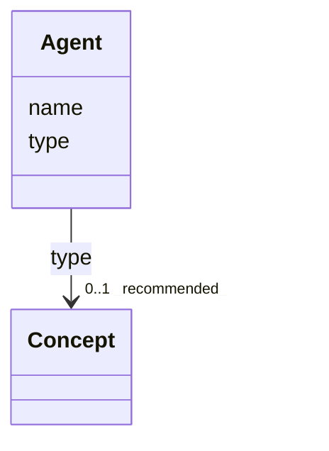

# Class: Agent 


_See [DCAT-AP specs:Agent](https://semiceu.github.io/DCAT-AP/releases/3.0.0/#Agent)_


URI: [foaf:Agent](http://xmlns.com/foaf/0.1/Agent)





<!-- no inheritance hierarchy -->


## Slots

| Name | Cardinality and Range | Description | Inheritance |
| ---  | --- | --- | --- |
| [name](../slots/name.md) | 1..* <br/> [String](../types/String.md) | A name of the agent. | direct |
| [type](../slots/type.md) | 0..1 _recommended_ <br/> [Concept](../classes/Concept.md) | The nature of the agent. | direct |


## Usages

| used by | used in | type | used |
| ---  | --- | --- | --- |
| [AnalysisDataset](../classes/AnalysisDataset.md) | [creator](../slots/creator.md) | range | [Agent](../classes/Agent.md) |
| [AnalysisDataset](../classes/AnalysisDataset.md) | [publisher](../slots/publisher.md) | range | [Agent](../classes/Agent.md) |
| [Catalogue](../classes/Catalogue.md) | [creator](../slots/creator.md) | range | [Agent](../classes/Agent.md) |
| [Catalogue](../classes/Catalogue.md) | [publisher](../slots/publisher.md) | range | [Agent](../classes/Agent.md) |
| [DataService](../classes/DataService.md) | [publisher](../slots/publisher.md) | range | [Agent](../classes/Agent.md) |
| [Dataset](../classes/Dataset.md) | [creator](../slots/creator.md) | range | [Agent](../classes/Agent.md) |
| [Dataset](../classes/Dataset.md) | [publisher](../slots/publisher.md) | range | [Agent](../classes/Agent.md) |
| [DatasetSeries](../classes/DatasetSeries.md) | [publisher](../slots/publisher.md) | range | [Agent](../classes/Agent.md) |


## Identifier and Mapping Information


### Schema Source


* from schema: https://nfdi-de.github.io/dcat-ap-plus/dcat_ap_plus.yaml


## Mappings

| Mapping Type | Mapped Value |
| ---  | ---  |
| self | foaf:Agent |
| native | dcatap_plus:Agent |


## LinkML Source

<!-- TODO: investigate https://stackoverflow.com/questions/37606292/how-to-create-tabbed-code-blocks-in-mkdocs-or-sphinx -->

### Direct

<details>
```yaml
name: Agent
description: See [DCAT-AP specs:Agent](https://semiceu.github.io/DCAT-AP/releases/3.0.0/#Agent)
from_schema: https://nfdi-de.github.io/dcat-ap-plus/dcat_ap_plus.yaml
slots:
- name
- type
slot_usage:
  name:
    name: name
    description: A name of the agent.
    slot_uri: foaf:name
    range: string
    required: true
    multivalued: true
    inlined_as_list: true
  type:
    name: type
    description: The nature of the agent.
    slot_uri: dcterms:type
    range: Concept
    required: false
    recommended: true
    multivalued: false
    inlined_as_list: true
class_uri: foaf:Agent

```
</details>

### Induced

<details>
```yaml
name: Agent
description: See [DCAT-AP specs:Agent](https://semiceu.github.io/DCAT-AP/releases/3.0.0/#Agent)
from_schema: https://nfdi-de.github.io/dcat-ap-plus/dcat_ap_plus.yaml
slot_usage:
  name:
    name: name
    description: A name of the agent.
    slot_uri: foaf:name
    range: string
    required: true
    multivalued: true
    inlined_as_list: true
  type:
    name: type
    description: The nature of the agent.
    slot_uri: dcterms:type
    range: Concept
    required: false
    recommended: true
    multivalued: false
    inlined_as_list: true
attributes:
  name:
    name: name
    description: A name of the agent.
    from_schema: https://nfdi-de.github.io/dcat-ap-plus/dcat_ap_plus.yaml
    rank: 1000
    slot_uri: foaf:name
    alias: name
    owner: Agent
    domain_of:
    - Agent
    range: string
    required: true
    multivalued: true
    inlined_as_list: true
  type:
    name: type
    description: The nature of the agent.
    from_schema: https://nfdi-de.github.io/dcat-ap-plus/dcat_ap_plus.yaml
    rank: 1000
    slot_uri: dcterms:type
    alias: type
    owner: Agent
    domain_of:
    - Agent
    - ClassifierMixin
    - Dataset
    - LicenseDocument
    range: Concept
    required: false
    recommended: true
    multivalued: false
    inlined_as_list: true
class_uri: foaf:Agent

```
</details>