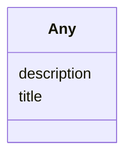

# Class: Any 


_This abstract class is needed to create the union of Dataset, DatasetSeries, Catalogue and DataService for the range of the slot [primary_topic](https://nfdi-de.github.io/chem-dcat-ap/elements/primary_topic/)._


URI: [linkml:Any](https://w3id.org/linkml/Any)





<!-- no inheritance hierarchy -->


## Slots

| Name | Cardinality and Range | Description | Inheritance |
| ---  | --- | --- | --- |
| [title](../slots/title.md) | 0..1 <br/> [String](../types/String.md) | This slot is described in more detail within the class in which it is used. | direct |
| [description](../slots/description.md) | 0..1 <br/> [String](../types/String.md) | This slot is described in more detail within the class in which it is used. | direct |


## Usages

| used by | used in | type | used |
| ---  | --- | --- | --- |
| [CatalogueRecord](../classes/CatalogueRecord.md) | [primary_topic](../slots/primary_topic.md) | range | [Any](../classes/Any.md) |


## Identifier and Mapping Information


### Schema Source


* from schema: https://nfdi-de.github.io/dcat-ap-plus/dcat_ap_plus.yaml


## Mappings

| Mapping Type | Mapped Value |
| ---  | ---  |
| self | linkml:Any |
| native | dcatap_plus:Any |


## LinkML Source

<!-- TODO: investigate https://stackoverflow.com/questions/37606292/how-to-create-tabbed-code-blocks-in-mkdocs-or-sphinx -->

### Direct

<details>
```yaml
name: Any
description: This abstract class is needed to create the union of Dataset, DatasetSeries,
  Catalogue and DataService for the range of the slot [primary_topic](https://nfdi-de.github.io/chem-dcat-ap/elements/primary_topic/).
from_schema: https://nfdi-de.github.io/dcat-ap-plus/dcat_ap_plus.yaml
slots:
- title
- description
class_uri: linkml:Any

```
</details>

### Induced

<details>
```yaml
name: Any
description: This abstract class is needed to create the union of Dataset, DatasetSeries,
  Catalogue and DataService for the range of the slot [primary_topic](https://nfdi-de.github.io/chem-dcat-ap/elements/primary_topic/).
from_schema: https://nfdi-de.github.io/dcat-ap-plus/dcat_ap_plus.yaml
attributes:
  title:
    name: title
    description: This slot is described in more detail within the class in which it
      is used.
    from_schema: https://nfdi-de.github.io/dcat-ap-plus/dcat_ap_plus.yaml
    rank: 1000
    slot_uri: dcterms:title
    alias: title
    owner: Any
    domain_of:
    - Activity
    - AgenticEntity
    - Any
    - Attribution
    - Catalogue
    - CatalogueRecord
    - ChecksumAlgorithm
    - Concept
    - ConceptScheme
    - DataService
    - Dataset
    - DatasetSeries
    - DefinedTerm
    - Distribution
    - Document
    - Entity
    - Frequency
    - Geometry
    - Identifier
    - LegalResource
    - LicenseDocument
    - LinguisticSystem
    - MediaType
    - MediaTypeOrExtent
    - PeriodOfTime
    - Plan
    - Policy
    - ProvenanceStatement
    - QualitativeAttribute
    - QuantitativeAttribute
    - Resource
    - RightsStatement
    - Role
    - Standard
    - SupportiveEntity
    - Surrounding
    - TimeInstant
    range: string
  description:
    name: description
    description: This slot is described in more detail within the class in which it
      is used.
    from_schema: https://nfdi-de.github.io/dcat-ap-plus/dcat_ap_plus.yaml
    rank: 1000
    slot_uri: dcterms:description
    alias: description
    owner: Any
    domain_of:
    - Activity
    - AgenticEntity
    - Any
    - Attribution
    - Catalogue
    - CatalogueRecord
    - ChecksumAlgorithm
    - Concept
    - ConceptScheme
    - DataService
    - Dataset
    - DatasetSeries
    - Distribution
    - Document
    - Entity
    - Frequency
    - Geometry
    - Identifier
    - LegalResource
    - LicenseDocument
    - LinguisticSystem
    - MediaType
    - MediaTypeOrExtent
    - PeriodOfTime
    - Plan
    - Policy
    - ProvenanceStatement
    - QualitativeAttribute
    - QuantitativeAttribute
    - Resource
    - RightsStatement
    - Role
    - Standard
    - SupportiveEntity
    - Surrounding
    - TimeInstant
    range: string
class_uri: linkml:Any

```
</details>