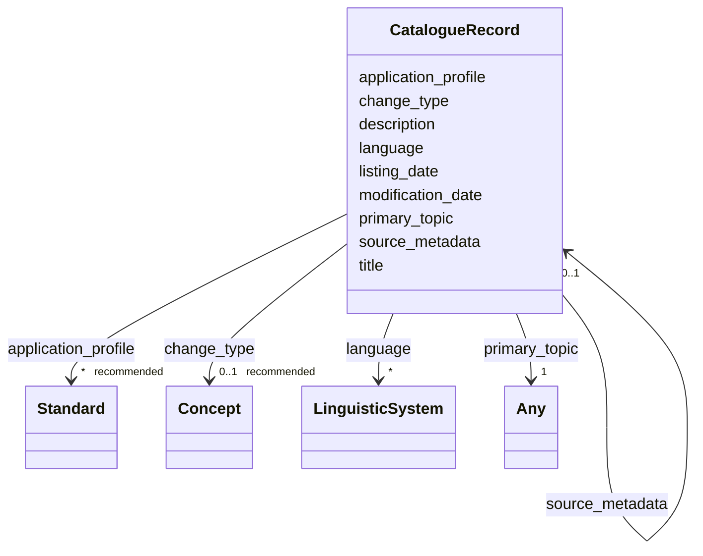

# Class: CatalogueRecord 


_See [DCAT-AP specs:CatalogueRecord](https://semiceu.github.io/DCAT-AP/releases/3.0.0/#CatalogueRecord)_


URI: [dcat:CatalogRecord](http://www.w3.org/ns/dcat#CatalogRecord)





<!-- no inheritance hierarchy -->


## Slots

| Name | Cardinality and Range | Description | Inheritance |
| ---  | --- | --- | --- |
| [application_profile](../slots/application_profile.md) | * _recommended_ <br/> [Standard](../classes/Standard.md) | An Application Profile that the Catalogued Resource&#39;s metadata conforms to. | direct |
| [change_type](../slots/change_type.md) | 0..1 _recommended_ <br/> [Concept](../classes/Concept.md) | The status of the catalogue record in the context of editorial flow of the dataset and data service descriptions. | direct |
| [description](../slots/description.md) | * <br/> [String](../types/String.md) | A free-text account of the record. This property can be repeated for parallel language versions of the description. | direct |
| [language](../slots/language.md) | * <br/> [LinguisticSystem](../classes/LinguisticSystem.md) | A language used in the textual metadata describing titles, descriptions, etc. of the Catalogued Resource. | direct |
| [listing_date](../slots/listing_date.md) | 0..1 _recommended_ <br/> [Date](../types/Date.md) | The date on which the description of the Resource was included in the Catalogue. | direct |
| [modification_date](../slots/modification_date.md) | 1 <br/> [Date](../types/Date.md) | The most recent date on which the Catalogue entry was changed or modified. | direct |
| [primary_topic](../slots/primary_topic.md) | 1 <br/> [Any](../classes/Any.md)&nbsp;or&nbsp;<br />[Catalogue](../classes/Catalogue.md)&nbsp;or&nbsp;<br />[Dataset](../classes/Dataset.md)&nbsp;or&nbsp;<br />[DatasetSeries](../classes/DatasetSeries.md)&nbsp;or&nbsp;<br />[DataService](../classes/DataService.md) | A link to the Dataset, Data service or Catalog described in the record. | direct |
| [source_metadata](../slots/source_metadata.md) | 0..1 <br/> [CatalogueRecord](../classes/CatalogueRecord.md) | The original metadata that was used in creating metadata for the Dataset, Data Service or Dataset Series. | direct |
| [title](../slots/title.md) | * <br/> [String](../types/String.md) | A name given to the Catalogue Record. | direct |


## Usages

| used by | used in | type | used |
| ---  | --- | --- | --- |
| [Catalogue](../classes/Catalogue.md) | [record](../slots/record.md) | range | [CatalogueRecord](../classes/CatalogueRecord.md) |
| [CatalogueRecord](../classes/CatalogueRecord.md) | [source_metadata](../slots/source_metadata.md) | range | [CatalogueRecord](../classes/CatalogueRecord.md) |


## Identifier and Mapping Information


### Schema Source


* from schema: https://nfdi-de.github.io/dcat-ap-plus/dcat_ap_plus.yaml


## Mappings

| Mapping Type | Mapped Value |
| ---  | ---  |
| self | dcat:CatalogRecord |
| native | dcatap_plus:CatalogueRecord |


## LinkML Source

<!-- TODO: investigate https://stackoverflow.com/questions/37606292/how-to-create-tabbed-code-blocks-in-mkdocs-or-sphinx -->

### Direct

<details>
```yaml
name: CatalogueRecord
description: See [DCAT-AP specs:CatalogueRecord](https://semiceu.github.io/DCAT-AP/releases/3.0.0/#CatalogueRecord)
from_schema: https://nfdi-de.github.io/dcat-ap-plus/dcat_ap_plus.yaml
slots:
- application_profile
- change_type
- description
- language
- listing_date
- modification_date
- primary_topic
- source_metadata
- title
slot_usage:
  application_profile:
    name: application_profile
    description: An Application Profile that the Catalogued Resource&#39;s metadata
      conforms to.
    slot_uri: dcterms:conformsTo
    range: Standard
    required: false
    recommended: true
    multivalued: true
    inlined_as_list: true
  change_type:
    name: change_type
    description: The status of the catalogue record in the context of editorial flow
      of the dataset and data service descriptions.
    slot_uri: adms:status
    range: Concept
    required: false
    recommended: true
    multivalued: false
    inlined_as_list: true
  description:
    name: description
    description: A free-text account of the record. This property can be repeated
      for parallel language versions of the description.
    slot_uri: dcterms:description
    range: string
    required: false
    multivalued: true
    inlined_as_list: true
  language:
    name: language
    description: A language used in the textual metadata describing titles, descriptions,
      etc. of the Catalogued Resource.
    slot_uri: dcterms:language
    range: LinguisticSystem
    required: false
    multivalued: true
    inlined_as_list: true
  listing_date:
    name: listing_date
    description: The date on which the description of the Resource was included in
      the Catalogue.
    slot_uri: dcterms:issued
    range: date
    required: false
    recommended: true
    multivalued: false
    inlined_as_list: true
  modification_date:
    name: modification_date
    description: The most recent date on which the Catalogue entry was changed or
      modified.
    slot_uri: dcterms:modified
    range: date
    required: true
    multivalued: false
    inlined_as_list: false
  primary_topic:
    name: primary_topic
    description: A link to the Dataset, Data service or Catalog described in the record.
    slot_uri: foaf:primaryTopic
    range: Any
    required: true
    multivalued: false
    inlined_as_list: false
    any_of:
    - range: Catalogue
    - range: Dataset
    - range: DatasetSeries
    - range: DataService
  source_metadata:
    name: source_metadata
    description: The original metadata that was used in creating metadata for the
      Dataset, Data Service or Dataset Series.
    slot_uri: dcterms:source
    range: CatalogueRecord
    required: false
    multivalued: false
    inlined_as_list: true
  title:
    name: title
    description: A name given to the Catalogue Record.
    slot_uri: dcterms:title
    range: string
    required: false
    multivalued: true
    inlined_as_list: true
class_uri: dcat:CatalogRecord

```
</details>

### Induced

<details>
```yaml
name: CatalogueRecord
description: See [DCAT-AP specs:CatalogueRecord](https://semiceu.github.io/DCAT-AP/releases/3.0.0/#CatalogueRecord)
from_schema: https://nfdi-de.github.io/dcat-ap-plus/dcat_ap_plus.yaml
slot_usage:
  application_profile:
    name: application_profile
    description: An Application Profile that the Catalogued Resource&#39;s metadata
      conforms to.
    slot_uri: dcterms:conformsTo
    range: Standard
    required: false
    recommended: true
    multivalued: true
    inlined_as_list: true
  change_type:
    name: change_type
    description: The status of the catalogue record in the context of editorial flow
      of the dataset and data service descriptions.
    slot_uri: adms:status
    range: Concept
    required: false
    recommended: true
    multivalued: false
    inlined_as_list: true
  description:
    name: description
    description: A free-text account of the record. This property can be repeated
      for parallel language versions of the description.
    slot_uri: dcterms:description
    range: string
    required: false
    multivalued: true
    inlined_as_list: true
  language:
    name: language
    description: A language used in the textual metadata describing titles, descriptions,
      etc. of the Catalogued Resource.
    slot_uri: dcterms:language
    range: LinguisticSystem
    required: false
    multivalued: true
    inlined_as_list: true
  listing_date:
    name: listing_date
    description: The date on which the description of the Resource was included in
      the Catalogue.
    slot_uri: dcterms:issued
    range: date
    required: false
    recommended: true
    multivalued: false
    inlined_as_list: true
  modification_date:
    name: modification_date
    description: The most recent date on which the Catalogue entry was changed or
      modified.
    slot_uri: dcterms:modified
    range: date
    required: true
    multivalued: false
    inlined_as_list: false
  primary_topic:
    name: primary_topic
    description: A link to the Dataset, Data service or Catalog described in the record.
    slot_uri: foaf:primaryTopic
    range: Any
    required: true
    multivalued: false
    inlined_as_list: false
    any_of:
    - range: Catalogue
    - range: Dataset
    - range: DatasetSeries
    - range: DataService
  source_metadata:
    name: source_metadata
    description: The original metadata that was used in creating metadata for the
      Dataset, Data Service or Dataset Series.
    slot_uri: dcterms:source
    range: CatalogueRecord
    required: false
    multivalued: false
    inlined_as_list: true
  title:
    name: title
    description: A name given to the Catalogue Record.
    slot_uri: dcterms:title
    range: string
    required: false
    multivalued: true
    inlined_as_list: true
attributes:
  application_profile:
    name: application_profile
    description: An Application Profile that the Catalogued Resource&#39;s metadata
      conforms to.
    from_schema: https://nfdi-de.github.io/dcat-ap-plus/dcat_ap_plus.yaml
    rank: 1000
    slot_uri: dcterms:conformsTo
    alias: application_profile
    owner: CatalogueRecord
    domain_of:
    - CatalogueRecord
    range: Standard
    required: false
    recommended: true
    multivalued: true
    inlined_as_list: true
  change_type:
    name: change_type
    description: The status of the catalogue record in the context of editorial flow
      of the dataset and data service descriptions.
    from_schema: https://nfdi-de.github.io/dcat-ap-plus/dcat_ap_plus.yaml
    rank: 1000
    slot_uri: adms:status
    alias: change_type
    owner: CatalogueRecord
    domain_of:
    - CatalogueRecord
    range: Concept
    required: false
    recommended: true
    multivalued: false
    inlined_as_list: true
  description:
    name: description
    description: A free-text account of the record. This property can be repeated
      for parallel language versions of the description.
    from_schema: https://nfdi-de.github.io/dcat-ap-plus/dcat_ap_plus.yaml
    rank: 1000
    slot_uri: dcterms:description
    alias: description
    owner: CatalogueRecord
    domain_of:
    - Activity
    - AgenticEntity
    - Any
    - Attribution
    - Catalogue
    - CatalogueRecord
    - ChecksumAlgorithm
    - Concept
    - ConceptScheme
    - DataService
    - Dataset
    - DatasetSeries
    - Distribution
    - Document
    - Entity
    - Frequency
    - Geometry
    - Identifier
    - LegalResource
    - LicenseDocument
    - LinguisticSystem
    - MediaType
    - MediaTypeOrExtent
    - PeriodOfTime
    - Plan
    - Policy
    - ProvenanceStatement
    - QualitativeAttribute
    - QuantitativeAttribute
    - Resource
    - RightsStatement
    - Role
    - Standard
    - SupportiveEntity
    - Surrounding
    - TimeInstant
    range: string
    required: false
    multivalued: true
    inlined_as_list: true
  language:
    name: language
    description: A language used in the textual metadata describing titles, descriptions,
      etc. of the Catalogued Resource.
    from_schema: https://nfdi-de.github.io/dcat-ap-plus/dcat_ap_plus.yaml
    rank: 1000
    slot_uri: dcterms:language
    alias: language
    owner: CatalogueRecord
    domain_of:
    - Catalogue
    - CatalogueRecord
    - Dataset
    - Distribution
    range: LinguisticSystem
    required: false
    multivalued: true
    inlined_as_list: true
  listing_date:
    name: listing_date
    description: The date on which the description of the Resource was included in
      the Catalogue.
    from_schema: https://nfdi-de.github.io/dcat-ap-plus/dcat_ap_plus.yaml
    rank: 1000
    slot_uri: dcterms:issued
    alias: listing_date
    owner: CatalogueRecord
    domain_of:
    - CatalogueRecord
    range: date
    required: false
    recommended: true
    multivalued: false
    inlined_as_list: true
  modification_date:
    name: modification_date
    description: The most recent date on which the Catalogue entry was changed or
      modified.
    from_schema: https://nfdi-de.github.io/dcat-ap-plus/dcat_ap_plus.yaml
    rank: 1000
    slot_uri: dcterms:modified
    alias: modification_date
    owner: CatalogueRecord
    domain_of:
    - Catalogue
    - CatalogueRecord
    - Dataset
    - DatasetSeries
    - Distribution
    range: date
    required: true
    multivalued: false
    inlined_as_list: false
  primary_topic:
    name: primary_topic
    description: A link to the Dataset, Data service or Catalog described in the record.
    from_schema: https://nfdi-de.github.io/dcat-ap-plus/dcat_ap_plus.yaml
    rank: 1000
    slot_uri: foaf:primaryTopic
    alias: primary_topic
    owner: CatalogueRecord
    domain_of:
    - CatalogueRecord
    range: Any
    required: true
    multivalued: false
    inlined_as_list: false
    any_of:
    - range: Catalogue
    - range: Dataset
    - range: DatasetSeries
    - range: DataService
  source_metadata:
    name: source_metadata
    description: The original metadata that was used in creating metadata for the
      Dataset, Data Service or Dataset Series.
    from_schema: https://nfdi-de.github.io/dcat-ap-plus/dcat_ap_plus.yaml
    rank: 1000
    slot_uri: dcterms:source
    alias: source_metadata
    owner: CatalogueRecord
    domain_of:
    - CatalogueRecord
    range: CatalogueRecord
    required: false
    multivalued: false
    inlined_as_list: true
  title:
    name: title
    description: A name given to the Catalogue Record.
    from_schema: https://nfdi-de.github.io/dcat-ap-plus/dcat_ap_plus.yaml
    rank: 1000
    slot_uri: dcterms:title
    alias: title
    owner: CatalogueRecord
    domain_of:
    - Activity
    - AgenticEntity
    - Any
    - Attribution
    - Catalogue
    - CatalogueRecord
    - ChecksumAlgorithm
    - Concept
    - ConceptScheme
    - DataService
    - Dataset
    - DatasetSeries
    - DefinedTerm
    - Distribution
    - Document
    - Entity
    - Frequency
    - Geometry
    - Identifier
    - LegalResource
    - LicenseDocument
    - LinguisticSystem
    - MediaType
    - MediaTypeOrExtent
    - PeriodOfTime
    - Plan
    - Policy
    - ProvenanceStatement
    - QualitativeAttribute
    - QuantitativeAttribute
    - Resource
    - RightsStatement
    - Role
    - Standard
    - SupportiveEntity
    - Surrounding
    - TimeInstant
    range: string
    required: false
    multivalued: true
    inlined_as_list: true
class_uri: dcat:CatalogRecord

```
</details>