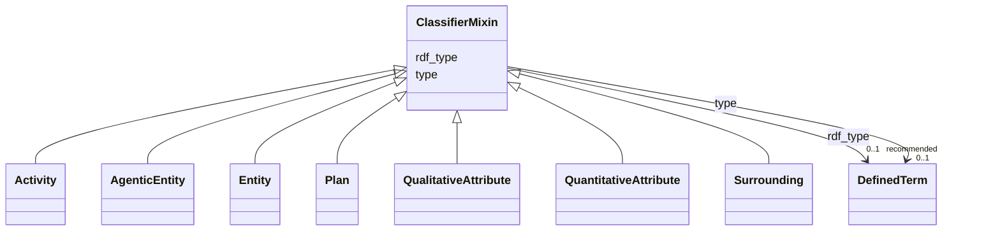

# Class: ClassifierMixin 


_A mixin with which an entity of this schema can be classified via an additional rdf:type or dcterms:type assertion._


* __NOTE__: this is an abstract class and should not be instantiated directly


URI: [dcatap_plus:class/ClassifierMixin](https://nfdi-de.github.io/dcat-ap-plus/dcat_ap_plus.yaml#class/ClassifierMixin)





<!-- no inheritance hierarchy -->


## Slots

| Name | Cardinality and Range | Description | Inheritance |
| ---  | --- | --- | --- |
| [type](../slots/type.md) | 0..1 <br/> [DefinedTerm](../classes/DefinedTerm.md) | This slot is described in more detail within the class in which it is used. | direct |
| [rdf_type](../slots/rdf_type.md) | 0..1 _recommended_ <br/> [DefinedTerm](../classes/DefinedTerm.md) | The slot to specify the ontology class that is instantiated by an entity. | direct |


## Mixin Usage

| mixed into | description |
| --- | --- |
| [Activity](../classes/Activity.md) | See [DCAT-AP specs:Activity](https://semiceu.github.io/DCAT-AP/releases/3.0.0/#Activity) |
| [AgenticEntity](../classes/AgenticEntity.md) | An entity that is somehow responsible for an Activity to take place. |
| [Entity](../classes/Entity.md) | A physical, digital, conceptual, or other kind of thing with some fixed aspects; entities may be real or imaginary. |
| [Plan](../classes/Plan.md) | A piece of information that specifies how an activity has to be carried out by its agents including what kind of steps have to be taken and what kind of parameters have to be met/set. |
| [QualitativeAttribute](../classes/QualitativeAttribute.md) | A piece of information that is attributed to an Entity, Activity or AgenticEntity. |
| [QuantitativeAttribute](../classes/QuantitativeAttribute.md) | A quantifiable piece of information that is attributed to an Entity, Activity or AgenticEntity. |
| [Surrounding](../classes/Surrounding.md) | The surrounding in which the dataset creating activity took place (e.g. a lab). |


## Identifier and Mapping Information


### Schema Source


* from schema: https://nfdi-de.github.io/dcat-ap-plus/dcat_ap_plus.yaml


## Mappings

| Mapping Type | Mapped Value |
| ---  | ---  |
| self | dcatap_plus:ClassifierMixin |
| native | dcatap_plus:ClassifierMixin |


## LinkML Source

<!-- TODO: investigate https://stackoverflow.com/questions/37606292/how-to-create-tabbed-code-blocks-in-mkdocs-or-sphinx -->

### Direct

<details>
```yaml
name: ClassifierMixin
description: A mixin with which an entity of this schema can be classified via an
  additional rdf:type or dcterms:type assertion.
in_subset:
- domain_agnostic_core
from_schema: https://nfdi-de.github.io/dcat-ap-plus/dcat_ap_plus.yaml
abstract: true
mixin: true
slots:
- type
- rdf_type
slot_usage:
  type:
    name: type
    range: DefinedTerm
    inlined: true

```
</details>

### Induced

<details>
```yaml
name: ClassifierMixin
description: A mixin with which an entity of this schema can be classified via an
  additional rdf:type or dcterms:type assertion.
in_subset:
- domain_agnostic_core
from_schema: https://nfdi-de.github.io/dcat-ap-plus/dcat_ap_plus.yaml
abstract: true
mixin: true
slot_usage:
  type:
    name: type
    range: DefinedTerm
    inlined: true
attributes:
  type:
    name: type
    description: This slot is described in more detail within the class in which it
      is used.
    from_schema: https://nfdi-de.github.io/dcat-ap-plus/dcat_ap_plus.yaml
    rank: 1000
    slot_uri: dcterms:type
    alias: type
    owner: ClassifierMixin
    domain_of:
    - Agent
    - ClassifierMixin
    - Dataset
    - LicenseDocument
    range: DefinedTerm
    inlined: true
  rdf_type:
    name: rdf_type
    description: The slot to specify the ontology class that is instantiated by an
      entity.
    in_subset:
    - domain_agnostic_core
    from_schema: https://nfdi-de.github.io/dcat-ap-plus/dcat_ap_plus.yaml
    rank: 1000
    slot_uri: rdf:type
    alias: rdf_type
    owner: ClassifierMixin
    domain_of:
    - ClassifierMixin
    range: DefinedTerm
    recommended: true
    inlined: true

```
</details>