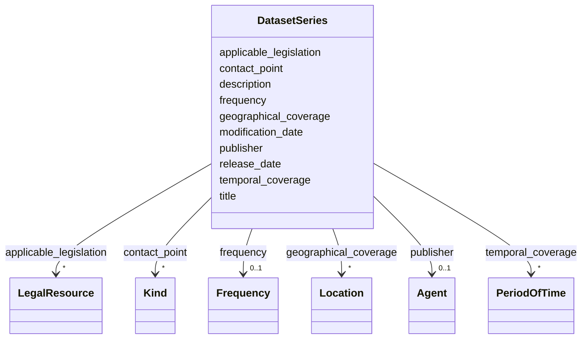

# Class: DatasetSeries 


_See [DCAT-AP specs:DatasetSeries](https://semiceu.github.io/DCAT-AP/releases/3.0.0/#DatasetSeries)_


URI: [dcat:DatasetSeries](http://www.w3.org/ns/dcat#DatasetSeries)





<!-- no inheritance hierarchy -->


## Slots

| Name | Cardinality and Range | Description | Inheritance |
| ---  | --- | --- | --- |
| [applicable_legislation](../slots/applicable_legislation.md) | * <br/> [LegalResource](../classes/LegalResource.md) | The legislation that mandates the creation or management of the Dataset Series. | direct |
| [contact_point](../slots/contact_point.md) | * <br/> [Kind](../classes/Kind.md) | Contact information that can be used for sending comments about the Dataset Series. | direct |
| [description](../slots/description.md) | 1..* <br/> [String](../types/String.md) | A free-text account of the Dataset Series. | direct |
| [frequency](../slots/frequency.md) | 0..1 <br/> [Frequency](../classes/Frequency.md) | The frequency at which the Dataset Series is updated. | direct |
| [geographical_coverage](../slots/geographical_coverage.md) | * <br/> [Location](../classes/Location.md) | A geographic region that is covered by the Dataset Series. | direct |
| [modification_date](../slots/modification_date.md) | 0..1 <br/> [Date](../types/Date.md) | The most recent date on which the Dataset Series was changed or modified. | direct |
| [publisher](../slots/publisher.md) | 0..1 <br/> [Agent](../classes/Agent.md) | An entity (organisation) responsible for ensuring the coherency of the Dataset Series | direct |
| [release_date](../slots/release_date.md) | 0..1 <br/> [Date](../types/Date.md) | The date of formal issuance (e.g., publication) of the Dataset Series. | direct |
| [temporal_coverage](../slots/temporal_coverage.md) | * <br/> [PeriodOfTime](../classes/PeriodOfTime.md) | A temporal period that the Dataset Series covers. | direct |
| [title](../slots/title.md) | 1..* <br/> [String](../types/String.md) | A name given to the Dataset Series. | direct |


## Usages

| used by | used in | type | used |
| ---  | --- | --- | --- |
| [AnalysisDataset](../classes/AnalysisDataset.md) | [in_series](../slots/in_series.md) | range | [DatasetSeries](../classes/DatasetSeries.md) |
| [CatalogueRecord](../classes/CatalogueRecord.md) | [primary_topic](../slots/primary_topic.md) | any_of[range] | [DatasetSeries](../classes/DatasetSeries.md) |
| [Dataset](../classes/Dataset.md) | [in_series](../slots/in_series.md) | range | [DatasetSeries](../classes/DatasetSeries.md) |


## Identifier and Mapping Information


### Schema Source


* from schema: https://nfdi-de.github.io/dcat-ap-plus/dcat_ap_plus.yaml


## Mappings

| Mapping Type | Mapped Value |
| ---  | ---  |
| self | dcat:DatasetSeries |
| native | dcatap_plus:DatasetSeries |


## LinkML Source

<!-- TODO: investigate https://stackoverflow.com/questions/37606292/how-to-create-tabbed-code-blocks-in-mkdocs-or-sphinx -->

### Direct

<details>
```yaml
name: DatasetSeries
description: See [DCAT-AP specs:DatasetSeries](https://semiceu.github.io/DCAT-AP/releases/3.0.0/#DatasetSeries)
from_schema: https://nfdi-de.github.io/dcat-ap-plus/dcat_ap_plus.yaml
slots:
- applicable_legislation
- contact_point
- description
- frequency
- geographical_coverage
- modification_date
- publisher
- release_date
- temporal_coverage
- title
slot_usage:
  applicable_legislation:
    name: applicable_legislation
    description: The legislation that mandates the creation or management of the Dataset
      Series.
    slot_uri: dcatap:applicableLegislation
    range: LegalResource
    required: false
    multivalued: true
    inlined_as_list: true
  contact_point:
    name: contact_point
    description: Contact information that can be used for sending comments about the
      Dataset Series.
    slot_uri: dcat:contactPoint
    range: Kind
    required: false
    multivalued: true
    inlined_as_list: true
  description:
    name: description
    description: A free-text account of the Dataset Series.
    slot_uri: dcterms:description
    range: string
    required: true
    multivalued: true
    inlined_as_list: true
  frequency:
    name: frequency
    description: The frequency at which the Dataset Series is updated.
    slot_uri: dcterms:accrualPeriodicity
    range: Frequency
    required: false
    multivalued: false
    inlined_as_list: false
  geographical_coverage:
    name: geographical_coverage
    description: A geographic region that is covered by the Dataset Series.
    slot_uri: dcterms:spatial
    range: Location
    required: false
    multivalued: true
    inlined_as_list: true
  modification_date:
    name: modification_date
    description: The most recent date on which the Dataset Series was changed or modified.
    slot_uri: dcterms:modified
    range: date
    required: false
    multivalued: false
    inlined_as_list: false
  publisher:
    name: publisher
    description: 'An entity (organisation) responsible for ensuring the coherency
      of the Dataset Series '
    slot_uri: dcterms:publisher
    range: Agent
    required: false
    multivalued: false
    inlined_as_list: true
  release_date:
    name: release_date
    description: The date of formal issuance (e.g., publication) of the Dataset Series.
    slot_uri: dcterms:issued
    range: date
    required: false
    multivalued: false
    inlined_as_list: false
  temporal_coverage:
    name: temporal_coverage
    description: A temporal period that the Dataset Series covers.
    slot_uri: dcterms:temporal
    range: PeriodOfTime
    required: false
    multivalued: true
    inlined_as_list: true
  title:
    name: title
    description: A name given to the Dataset Series.
    slot_uri: dcterms:title
    range: string
    required: true
    multivalued: true
    inlined_as_list: true
class_uri: dcat:DatasetSeries

```
</details>

### Induced

<details>
```yaml
name: DatasetSeries
description: See [DCAT-AP specs:DatasetSeries](https://semiceu.github.io/DCAT-AP/releases/3.0.0/#DatasetSeries)
from_schema: https://nfdi-de.github.io/dcat-ap-plus/dcat_ap_plus.yaml
slot_usage:
  applicable_legislation:
    name: applicable_legislation
    description: The legislation that mandates the creation or management of the Dataset
      Series.
    slot_uri: dcatap:applicableLegislation
    range: LegalResource
    required: false
    multivalued: true
    inlined_as_list: true
  contact_point:
    name: contact_point
    description: Contact information that can be used for sending comments about the
      Dataset Series.
    slot_uri: dcat:contactPoint
    range: Kind
    required: false
    multivalued: true
    inlined_as_list: true
  description:
    name: description
    description: A free-text account of the Dataset Series.
    slot_uri: dcterms:description
    range: string
    required: true
    multivalued: true
    inlined_as_list: true
  frequency:
    name: frequency
    description: The frequency at which the Dataset Series is updated.
    slot_uri: dcterms:accrualPeriodicity
    range: Frequency
    required: false
    multivalued: false
    inlined_as_list: false
  geographical_coverage:
    name: geographical_coverage
    description: A geographic region that is covered by the Dataset Series.
    slot_uri: dcterms:spatial
    range: Location
    required: false
    multivalued: true
    inlined_as_list: true
  modification_date:
    name: modification_date
    description: The most recent date on which the Dataset Series was changed or modified.
    slot_uri: dcterms:modified
    range: date
    required: false
    multivalued: false
    inlined_as_list: false
  publisher:
    name: publisher
    description: 'An entity (organisation) responsible for ensuring the coherency
      of the Dataset Series '
    slot_uri: dcterms:publisher
    range: Agent
    required: false
    multivalued: false
    inlined_as_list: true
  release_date:
    name: release_date
    description: The date of formal issuance (e.g., publication) of the Dataset Series.
    slot_uri: dcterms:issued
    range: date
    required: false
    multivalued: false
    inlined_as_list: false
  temporal_coverage:
    name: temporal_coverage
    description: A temporal period that the Dataset Series covers.
    slot_uri: dcterms:temporal
    range: PeriodOfTime
    required: false
    multivalued: true
    inlined_as_list: true
  title:
    name: title
    description: A name given to the Dataset Series.
    slot_uri: dcterms:title
    range: string
    required: true
    multivalued: true
    inlined_as_list: true
attributes:
  applicable_legislation:
    name: applicable_legislation
    description: The legislation that mandates the creation or management of the Dataset
      Series.
    from_schema: https://nfdi-de.github.io/dcat-ap-plus/dcat_ap_plus.yaml
    rank: 1000
    slot_uri: dcatap:applicableLegislation
    alias: applicable_legislation
    owner: DatasetSeries
    domain_of:
    - Catalogue
    - DataService
    - Dataset
    - DatasetSeries
    - Distribution
    range: LegalResource
    required: false
    multivalued: true
    inlined_as_list: true
  contact_point:
    name: contact_point
    description: Contact information that can be used for sending comments about the
      Dataset Series.
    from_schema: https://nfdi-de.github.io/dcat-ap-plus/dcat_ap_plus.yaml
    rank: 1000
    slot_uri: dcat:contactPoint
    alias: contact_point
    owner: DatasetSeries
    domain_of:
    - DataService
    - Dataset
    - DatasetSeries
    range: Kind
    required: false
    multivalued: true
    inlined_as_list: true
  description:
    name: description
    description: A free-text account of the Dataset Series.
    from_schema: https://nfdi-de.github.io/dcat-ap-plus/dcat_ap_plus.yaml
    rank: 1000
    slot_uri: dcterms:description
    alias: description
    owner: DatasetSeries
    domain_of:
    - Activity
    - AgenticEntity
    - Any
    - Attribution
    - Catalogue
    - CatalogueRecord
    - ChecksumAlgorithm
    - Concept
    - ConceptScheme
    - DataService
    - Dataset
    - DatasetSeries
    - Distribution
    - Document
    - Entity
    - Frequency
    - Geometry
    - Identifier
    - LegalResource
    - LicenseDocument
    - LinguisticSystem
    - MediaType
    - MediaTypeOrExtent
    - PeriodOfTime
    - Plan
    - Policy
    - ProvenanceStatement
    - QualitativeAttribute
    - QuantitativeAttribute
    - Resource
    - RightsStatement
    - Role
    - Standard
    - SupportiveEntity
    - Surrounding
    - TimeInstant
    range: string
    required: true
    multivalued: true
    inlined_as_list: true
  frequency:
    name: frequency
    description: The frequency at which the Dataset Series is updated.
    from_schema: https://nfdi-de.github.io/dcat-ap-plus/dcat_ap_plus.yaml
    rank: 1000
    slot_uri: dcterms:accrualPeriodicity
    alias: frequency
    owner: DatasetSeries
    domain_of:
    - Dataset
    - DatasetSeries
    range: Frequency
    required: false
    multivalued: false
    inlined_as_list: false
  geographical_coverage:
    name: geographical_coverage
    description: A geographic region that is covered by the Dataset Series.
    from_schema: https://nfdi-de.github.io/dcat-ap-plus/dcat_ap_plus.yaml
    rank: 1000
    slot_uri: dcterms:spatial
    alias: geographical_coverage
    owner: DatasetSeries
    domain_of:
    - Catalogue
    - Dataset
    - DatasetSeries
    range: Location
    required: false
    multivalued: true
    inlined_as_list: true
  modification_date:
    name: modification_date
    description: The most recent date on which the Dataset Series was changed or modified.
    from_schema: https://nfdi-de.github.io/dcat-ap-plus/dcat_ap_plus.yaml
    rank: 1000
    slot_uri: dcterms:modified
    alias: modification_date
    owner: DatasetSeries
    domain_of:
    - Catalogue
    - CatalogueRecord
    - Dataset
    - DatasetSeries
    - Distribution
    range: date
    required: false
    multivalued: false
    inlined_as_list: false
  publisher:
    name: publisher
    description: 'An entity (organisation) responsible for ensuring the coherency
      of the Dataset Series '
    from_schema: https://nfdi-de.github.io/dcat-ap-plus/dcat_ap_plus.yaml
    rank: 1000
    slot_uri: dcterms:publisher
    alias: publisher
    owner: DatasetSeries
    domain_of:
    - Catalogue
    - DataService
    - Dataset
    - DatasetSeries
    range: Agent
    required: false
    multivalued: false
    inlined_as_list: true
  release_date:
    name: release_date
    description: The date of formal issuance (e.g., publication) of the Dataset Series.
    from_schema: https://nfdi-de.github.io/dcat-ap-plus/dcat_ap_plus.yaml
    rank: 1000
    slot_uri: dcterms:issued
    alias: release_date
    owner: DatasetSeries
    domain_of:
    - Catalogue
    - Dataset
    - DatasetSeries
    - Distribution
    range: date
    required: false
    multivalued: false
    inlined_as_list: false
  temporal_coverage:
    name: temporal_coverage
    description: A temporal period that the Dataset Series covers.
    from_schema: https://nfdi-de.github.io/dcat-ap-plus/dcat_ap_plus.yaml
    rank: 1000
    slot_uri: dcterms:temporal
    alias: temporal_coverage
    owner: DatasetSeries
    domain_of:
    - Catalogue
    - Dataset
    - DatasetSeries
    range: PeriodOfTime
    required: false
    multivalued: true
    inlined_as_list: true
  title:
    name: title
    description: A name given to the Dataset Series.
    from_schema: https://nfdi-de.github.io/dcat-ap-plus/dcat_ap_plus.yaml
    rank: 1000
    slot_uri: dcterms:title
    alias: title
    owner: DatasetSeries
    domain_of:
    - Activity
    - AgenticEntity
    - Any
    - Attribution
    - Catalogue
    - CatalogueRecord
    - ChecksumAlgorithm
    - Concept
    - ConceptScheme
    - DataService
    - Dataset
    - DatasetSeries
    - DefinedTerm
    - Distribution
    - Document
    - Entity
    - Frequency
    - Geometry
    - Identifier
    - LegalResource
    - LicenseDocument
    - LinguisticSystem
    - MediaType
    - MediaTypeOrExtent
    - PeriodOfTime
    - Plan
    - Policy
    - ProvenanceStatement
    - QualitativeAttribute
    - QuantitativeAttribute
    - Resource
    - RightsStatement
    - Role
    - Standard
    - SupportiveEntity
    - Surrounding
    - TimeInstant
    range: string
    required: true
    multivalued: true
    inlined_as_list: true
class_uri: dcat:DatasetSeries

```
</details>