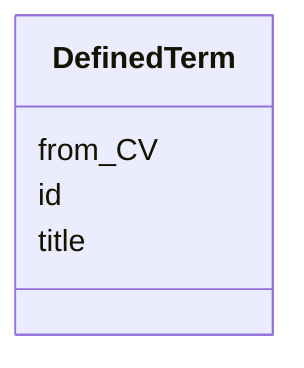

# Class: DefinedTerm 


_A word, name, acronym or phrase that is defined in a controlled vocabulary (CV) and that is used to provide an additional rdf:type or dcterms:type of a class within this schema._


URI: [schema:DefinedTerm](http://schema.org/DefinedTerm)





<!-- no inheritance hierarchy -->


## Slots

| Name | Cardinality and Range | Description | Inheritance |
| ---  | --- | --- | --- |
| [id](../slots/id.md) | 1 <br/> [Uriorcurie](../types/Uriorcurie.md) | A slot to provide an URI for an entity within this schema. | direct |
| [title](../slots/title.md) | 0..1 <br/> [String](../types/String.md) | This slot is described in more detail within the class in which it is used. | direct |
| [from_CV](../slots/from_CV.md) | 0..1 <br/> [Uriorcurie](../types/Uriorcurie.md) | The URL of the controlled vocabulary. | direct |


## Usages

| used by | used in | type | used |
| ---  | --- | --- | --- |
| [Activity](../classes/Activity.md) | [type](../slots/type.md) | range | [DefinedTerm](../classes/DefinedTerm.md) |
| [Activity](../classes/Activity.md) | [rdf_type](../slots/rdf_type.md) | range | [DefinedTerm](../classes/DefinedTerm.md) |
| [AgenticEntity](../classes/AgenticEntity.md) | [type](../slots/type.md) | range | [DefinedTerm](../classes/DefinedTerm.md) |
| [AgenticEntity](../classes/AgenticEntity.md) | [rdf_type](../slots/rdf_type.md) | range | [DefinedTerm](../classes/DefinedTerm.md) |
| [AnalysisSourceData](../classes/AnalysisSourceData.md) | [type](../slots/type.md) | range | [DefinedTerm](../classes/DefinedTerm.md) |
| [AnalysisSourceData](../classes/AnalysisSourceData.md) | [rdf_type](../slots/rdf_type.md) | range | [DefinedTerm](../classes/DefinedTerm.md) |
| [ClassifierMixin](../classes/ClassifierMixin.md) | [type](../slots/type.md) | range | [DefinedTerm](../classes/DefinedTerm.md) |
| [ClassifierMixin](../classes/ClassifierMixin.md) | [rdf_type](../slots/rdf_type.md) | range | [DefinedTerm](../classes/DefinedTerm.md) |
| [DataAnalysis](../classes/DataAnalysis.md) | [type](../slots/type.md) | range | [DefinedTerm](../classes/DefinedTerm.md) |
| [DataAnalysis](../classes/DataAnalysis.md) | [rdf_type](../slots/rdf_type.md) | range | [DefinedTerm](../classes/DefinedTerm.md) |
| [DataGeneratingActivity](../classes/DataGeneratingActivity.md) | [type](../slots/type.md) | range | [DefinedTerm](../classes/DefinedTerm.md) |
| [DataGeneratingActivity](../classes/DataGeneratingActivity.md) | [rdf_type](../slots/rdf_type.md) | range | [DefinedTerm](../classes/DefinedTerm.md) |
| [Device](../classes/Device.md) | [type](../slots/type.md) | range | [DefinedTerm](../classes/DefinedTerm.md) |
| [Device](../classes/Device.md) | [rdf_type](../slots/rdf_type.md) | range | [DefinedTerm](../classes/DefinedTerm.md) |
| [Entity](../classes/Entity.md) | [type](../slots/type.md) | range | [DefinedTerm](../classes/DefinedTerm.md) |
| [Entity](../classes/Entity.md) | [rdf_type](../slots/rdf_type.md) | range | [DefinedTerm](../classes/DefinedTerm.md) |
| [EvaluatedActivity](../classes/EvaluatedActivity.md) | [type](../slots/type.md) | range | [DefinedTerm](../classes/DefinedTerm.md) |
| [EvaluatedActivity](../classes/EvaluatedActivity.md) | [rdf_type](../slots/rdf_type.md) | range | [DefinedTerm](../classes/DefinedTerm.md) |
| [EvaluatedEntity](../classes/EvaluatedEntity.md) | [type](../slots/type.md) | range | [DefinedTerm](../classes/DefinedTerm.md) |
| [EvaluatedEntity](../classes/EvaluatedEntity.md) | [rdf_type](../slots/rdf_type.md) | range | [DefinedTerm](../classes/DefinedTerm.md) |
| [Plan](../classes/Plan.md) | [type](../slots/type.md) | range | [DefinedTerm](../classes/DefinedTerm.md) |
| [Plan](../classes/Plan.md) | [rdf_type](../slots/rdf_type.md) | range | [DefinedTerm](../classes/DefinedTerm.md) |
| [QualitativeAttribute](../classes/QualitativeAttribute.md) | [type](../slots/type.md) | range | [DefinedTerm](../classes/DefinedTerm.md) |
| [QualitativeAttribute](../classes/QualitativeAttribute.md) | [rdf_type](../slots/rdf_type.md) | range | [DefinedTerm](../classes/DefinedTerm.md) |
| [QuantitativeAttribute](../classes/QuantitativeAttribute.md) | [has_quantity_type](../slots/has_quantity_type.md) | range | [DefinedTerm](../classes/DefinedTerm.md) |
| [QuantitativeAttribute](../classes/QuantitativeAttribute.md) | [unit](../slots/unit.md) | range | [DefinedTerm](../classes/DefinedTerm.md) |
| [QuantitativeAttribute](../classes/QuantitativeAttribute.md) | [type](../slots/type.md) | range | [DefinedTerm](../classes/DefinedTerm.md) |
| [QuantitativeAttribute](../classes/QuantitativeAttribute.md) | [rdf_type](../slots/rdf_type.md) | range | [DefinedTerm](../classes/DefinedTerm.md) |
| [Software](../classes/Software.md) | [type](../slots/type.md) | range | [DefinedTerm](../classes/DefinedTerm.md) |
| [Software](../classes/Software.md) | [rdf_type](../slots/rdf_type.md) | range | [DefinedTerm](../classes/DefinedTerm.md) |
| [Surrounding](../classes/Surrounding.md) | [type](../slots/type.md) | range | [DefinedTerm](../classes/DefinedTerm.md) |
| [Surrounding](../classes/Surrounding.md) | [rdf_type](../slots/rdf_type.md) | range | [DefinedTerm](../classes/DefinedTerm.md) |


## Identifier and Mapping Information


### Schema Source


* from schema: https://nfdi-de.github.io/dcat-ap-plus/dcat_ap_plus.yaml


## Mappings

| Mapping Type | Mapped Value |
| ---  | ---  |
| self | schema:DefinedTerm |
| native | dcatap_plus:DefinedTerm |


## LinkML Source

<!-- TODO: investigate https://stackoverflow.com/questions/37606292/how-to-create-tabbed-code-blocks-in-mkdocs-or-sphinx -->

### Direct

<details>
```yaml
name: DefinedTerm
description: A word, name, acronym or phrase that is defined in a controlled vocabulary
  (CV) and that is used to provide an additional rdf:type or dcterms:type of a class
  within this schema.
in_subset:
- domain_agnostic_core
from_schema: https://nfdi-de.github.io/dcat-ap-plus/dcat_ap_plus.yaml
slots:
- id
- title
slot_usage:
  title:
    name: title
    slot_uri: schema:name
attributes:
  from_CV:
    name: from_CV
    description: The URL of the controlled vocabulary.
    from_schema: https://nfdi-de.github.io/dcat-ap-plus/dcat_ap_plus.yaml
    rank: 1000
    slot_uri: schema:inDefinedTermSet
    domain_of:
    - DefinedTerm
    range: uriorcurie
class_uri: schema:DefinedTerm

```
</details>

### Induced

<details>
```yaml
name: DefinedTerm
description: A word, name, acronym or phrase that is defined in a controlled vocabulary
  (CV) and that is used to provide an additional rdf:type or dcterms:type of a class
  within this schema.
in_subset:
- domain_agnostic_core
from_schema: https://nfdi-de.github.io/dcat-ap-plus/dcat_ap_plus.yaml
slot_usage:
  title:
    name: title
    slot_uri: schema:name
attributes:
  from_CV:
    name: from_CV
    description: The URL of the controlled vocabulary.
    from_schema: https://nfdi-de.github.io/dcat-ap-plus/dcat_ap_plus.yaml
    rank: 1000
    slot_uri: schema:inDefinedTermSet
    alias: from_CV
    owner: DefinedTerm
    domain_of:
    - DefinedTerm
    range: uriorcurie
  id:
    name: id
    description: A slot to provide an URI for an entity within this schema.
    in_subset:
    - domain_agnostic_core
    from_schema: https://nfdi-de.github.io/dcat-ap-plus/dcat_ap_plus.yaml
    rank: 1000
    identifier: true
    alias: id
    owner: DefinedTerm
    domain_of:
    - Activity
    - AgenticEntity
    - Dataset
    - DefinedTerm
    - Document
    - Entity
    - LegalResource
    - LicenseDocument
    - Resource
    range: uriorcurie
    required: true
  title:
    name: title
    description: This slot is described in more detail within the class in which it
      is used.
    from_schema: https://nfdi-de.github.io/dcat-ap-plus/dcat_ap_plus.yaml
    rank: 1000
    slot_uri: schema:name
    alias: title
    owner: DefinedTerm
    domain_of:
    - Activity
    - AgenticEntity
    - Any
    - Attribution
    - Catalogue
    - CatalogueRecord
    - ChecksumAlgorithm
    - Concept
    - ConceptScheme
    - DataService
    - Dataset
    - DatasetSeries
    - DefinedTerm
    - Distribution
    - Document
    - Entity
    - Frequency
    - Geometry
    - Identifier
    - LegalResource
    - LicenseDocument
    - LinguisticSystem
    - MediaType
    - MediaTypeOrExtent
    - PeriodOfTime
    - Plan
    - Policy
    - ProvenanceStatement
    - QualitativeAttribute
    - QuantitativeAttribute
    - Resource
    - RightsStatement
    - Role
    - Standard
    - SupportiveEntity
    - Surrounding
    - TimeInstant
    range: string
class_uri: schema:DefinedTerm

```
</details>