# Class: Distribution 


_See [DCAT-AP specs:Distribution](https://semiceu.github.io/DCAT-AP/releases/3.0.0/#Distribution)_


URI: [dcat:Distribution](http://www.w3.org/ns/dcat#Distribution)

```mermaid
 classDiagram
    class Distribution
    click Distribution href "../../classes/Distribution/"
      Distribution : access_service
        
          
    
        
        
        Distribution --> "*" DataService : access_service
        click DataService href "../../classes/DataService/"
    

        
      Distribution : access_URL
        
          
    
        
        
        Distribution --> "1..*" Resource : access_URL
        click Resource href "../../classes/Resource/"
    

        
      Distribution : applicable_legislation
        
          
    
        
        
        Distribution --> "*" LegalResource : applicable_legislation
        click LegalResource href "../../classes/LegalResource/"
    

        
      Distribution : availability
        
          
    
        
        
        Distribution --> "0..1 _recommended_" Concept : availability
        click Concept href "../../classes/Concept/"
    

        
      Distribution : byte_size
        
      Distribution : checksum
        
          
    
        
        
        Distribution --> "0..1" Checksum : checksum
        click Checksum href "../../classes/Checksum/"
    

        
      Distribution : compression_format
        
          
    
        
        
        Distribution --> "0..1" MediaType : compression_format
        click MediaType href "../../classes/MediaType/"
    

        
      Distribution : description
        
      Distribution : documentation
        
          
    
        
        
        Distribution --> "*" Document : documentation
        click Document href "../../classes/Document/"
    

        
      Distribution : download_URL
        
          
    
        
        
        Distribution --> "*" Resource : download_URL
        click Resource href "../../classes/Resource/"
    

        
      Distribution : format
        
          
    
        
        
        Distribution --> "0..1 _recommended_" MediaTypeOrExtent : format
        click MediaTypeOrExtent href "../../classes/MediaTypeOrExtent/"
    

        
      Distribution : has_policy
        
          
    
        
        
        Distribution --> "0..1" Policy : has_policy
        click Policy href "../../classes/Policy/"
    

        
      Distribution : language
        
          
    
        
        
        Distribution --> "*" LinguisticSystem : language
        click LinguisticSystem href "../../classes/LinguisticSystem/"
    

        
      Distribution : licence
        
          
    
        
        
        Distribution --> "0..1" LicenseDocument : licence
        click LicenseDocument href "../../classes/LicenseDocument/"
    

        
      Distribution : linked_schemas
        
          
    
        
        
        Distribution --> "*" Standard : linked_schemas
        click Standard href "../../classes/Standard/"
    

        
      Distribution : media_type
        
          
    
        
        
        Distribution --> "0..1" MediaType : media_type
        click MediaType href "../../classes/MediaType/"
    

        
      Distribution : modification_date
        
      Distribution : packaging_format
        
          
    
        
        
        Distribution --> "0..1" MediaType : packaging_format
        click MediaType href "../../classes/MediaType/"
    

        
      Distribution : release_date
        
      Distribution : rights
        
          
    
        
        
        Distribution --> "0..1" RightsStatement : rights
        click RightsStatement href "../../classes/RightsStatement/"
    

        
      Distribution : spatial_resolution
        
      Distribution : status
        
          
    
        
        
        Distribution --> "0..1" Concept : status
        click Concept href "../../classes/Concept/"
    

        
      Distribution : temporal_resolution
        
      Distribution : title
        
      
```





<!-- no inheritance hierarchy -->


## Slots

| Name | Cardinality and Range | Description | Inheritance |
| ---  | --- | --- | --- |
| [access_URL](../slots/access_URL.md) | 1..* <br/> [Resource](../classes/Resource.md) | A URL that gives access to a Distribution of the Dataset. | direct |
| [access_service](../slots/access_service.md) | * <br/> [DataService](../classes/DataService.md) | A data service that gives access to the distribution of the dataset. | direct |
| [applicable_legislation](../slots/applicable_legislation.md) | * <br/> [LegalResource](../classes/LegalResource.md) | The legislation that mandates the creation or management of the Distribution. | direct |
| [availability](../slots/availability.md) | 0..1 _recommended_ <br/> [Concept](../classes/Concept.md) | An indication how long it is planned to keep the Distribution of the Dataset available. | direct |
| [byte_size](../slots/byte_size.md) | 0..1 <br/> [NonNegativeInteger](../types/NonNegativeInteger.md) | The size of a Distribution in bytes. | direct |
| [checksum](../slots/checksum.md) | 0..1 <br/> [Checksum](../classes/Checksum.md) | A mechanism that can be used to verify that the contents of a distribution have not changed. | direct |
| [compression_format](../slots/compression_format.md) | 0..1 <br/> [MediaType](../classes/MediaType.md) | The format of the file in which the data is contained in a compressed form, e.g. to reduce the size of the downloadable file. | direct |
| [description](../slots/description.md) | * _recommended_ <br/> [String](../types/String.md) | A free-text account of the Distribution. | direct |
| [documentation](../slots/documentation.md) | * <br/> [Document](../classes/Document.md) | A page or document about this Distribution. | direct |
| [download_URL](../slots/download_URL.md) | * <br/> [Resource](../classes/Resource.md) | A URL that is a direct link to a downloadable file in a given format. | direct |
| [format](../slots/format.md) | 0..1 _recommended_ <br/> [MediaTypeOrExtent](../classes/MediaTypeOrExtent.md) | The file format of the Distribution. | direct |
| [has_policy](../slots/has_policy.md) | 0..1 <br/> [Policy](../classes/Policy.md) | The policy expressing the rights associated with the distribution if using the [[ODRL]] vocabulary. | direct |
| [language](../slots/language.md) | * <br/> [LinguisticSystem](../classes/LinguisticSystem.md) | A language used in the Distribution. | direct |
| [licence](../slots/licence.md) | 0..1 <br/> [LicenseDocument](../classes/LicenseDocument.md) | A licence under which the Distribution is made available. | direct |
| [linked_schemas](../slots/linked_schemas.md) | * <br/> [Standard](../classes/Standard.md) | An established schema to which the described Distribution conforms. | direct |
| [media_type](../slots/media_type.md) | 0..1 <br/> [MediaType](../classes/MediaType.md) | The media type of the Distribution as defined in the official register of media types managed by IANA. | direct |
| [modification_date](../slots/modification_date.md) | 0..1 <br/> [Date](../types/Date.md) | The most recent date on which the Distribution was changed or modified. | direct |
| [packaging_format](../slots/packaging_format.md) | 0..1 <br/> [MediaType](../classes/MediaType.md) | The format of the file in which one or more data files are grouped together, e.g. to enable a set of related files to be downloaded together. | direct |
| [release_date](../slots/release_date.md) | 0..1 <br/> [Date](../types/Date.md) | The date of formal issuance (e.g., publication) of the Distribution. | direct |
| [rights](../slots/rights.md) | 0..1 <br/> [RightsStatement](../classes/RightsStatement.md) | A statement that specifies rights associated with the Distribution. | direct |
| [spatial_resolution](../slots/spatial_resolution.md) | 0..1 <br/> [Decimal](../types/Decimal.md) | The minimum spatial separation resolvable in a dataset distribution, measured in meters. | direct |
| [status](../slots/status.md) | 0..1 <br/> [Concept](../classes/Concept.md) | The status of the distribution in the context of maturity lifecycle. | direct |
| [temporal_resolution](../slots/temporal_resolution.md) | 0..1 <br/> [Duration](../types/Duration.md) | The minimum time period resolvable in the dataset distribution. | direct |
| [title](../slots/title.md) | * <br/> [String](../types/String.md) | A name given to the Distribution. | direct |


## Usages

| used by | used in | type | used |
| ---  | --- | --- | --- |
| [AnalysisDataset](../classes/AnalysisDataset.md) | [dataset_distribution](../slots/dataset_distribution.md) | range | [Distribution](../classes/Distribution.md) |
| [AnalysisDataset](../classes/AnalysisDataset.md) | [sample](../slots/sample.md) | range | [Distribution](../classes/Distribution.md) |
| [Dataset](../classes/Dataset.md) | [dataset_distribution](../slots/dataset_distribution.md) | range | [Distribution](../classes/Distribution.md) |
| [Dataset](../classes/Dataset.md) | [sample](../slots/sample.md) | range | [Distribution](../classes/Distribution.md) |


## Identifier and Mapping Information


### Schema Source


* from schema: https://nfdi-de.github.io/dcat-ap-plus/dcat_ap_plus.yaml


## Mappings

| Mapping Type | Mapped Value |
| ---  | ---  |
| self | dcat:Distribution |
| native | dcatap_plus:Distribution |


## LinkML Source

<!-- TODO: investigate https://stackoverflow.com/questions/37606292/how-to-create-tabbed-code-blocks-in-mkdocs-or-sphinx -->

### Direct

<details>
```yaml
name: Distribution
description: See [DCAT-AP specs:Distribution](https://semiceu.github.io/DCAT-AP/releases/3.0.0/#Distribution)
from_schema: https://nfdi-de.github.io/dcat-ap-plus/dcat_ap_plus.yaml
slots:
- access_URL
- access_service
- applicable_legislation
- availability
- byte_size
- checksum
- compression_format
- description
- documentation
- download_URL
- format
- has_policy
- language
- licence
- linked_schemas
- media_type
- modification_date
- packaging_format
- release_date
- rights
- spatial_resolution
- status
- temporal_resolution
- title
slot_usage:
  access_URL:
    name: access_URL
    description: A URL that gives access to a Distribution of the Dataset.
    slot_uri: dcat:accessURL
    range: Resource
    required: true
    multivalued: true
    inlined_as_list: true
  access_service:
    name: access_service
    description: A data service that gives access to the distribution of the dataset.
    slot_uri: dcat:accessService
    range: DataService
    required: false
    multivalued: true
    inlined_as_list: true
  applicable_legislation:
    name: applicable_legislation
    description: The legislation that mandates the creation or management of the Distribution.
    slot_uri: dcatap:applicableLegislation
    range: LegalResource
    required: false
    multivalued: true
    inlined_as_list: true
  availability:
    name: availability
    description: An indication how long it is planned to keep the Distribution of
      the Dataset available.
    slot_uri: dcatap:availability
    range: Concept
    required: false
    recommended: true
    multivalued: false
    inlined_as_list: false
  byte_size:
    name: byte_size
    description: The size of a Distribution in bytes.
    slot_uri: dcat:byteSize
    range: nonNegativeInteger
    required: false
    multivalued: false
    inlined_as_list: false
  checksum:
    name: checksum
    description: A mechanism that can be used to verify that the contents of a distribution
      have not changed.
    slot_uri: spdx:checksum
    range: Checksum
    required: false
    multivalued: false
    inlined_as_list: true
  compression_format:
    name: compression_format
    description: The format of the file in which the data is contained in a compressed
      form, e.g. to reduce the size of the downloadable file.
    slot_uri: dcat:compressFormat
    range: MediaType
    required: false
    multivalued: false
    inlined_as_list: true
  description:
    name: description
    description: A free-text account of the Distribution.
    slot_uri: dcterms:description
    range: string
    required: false
    recommended: true
    multivalued: true
    inlined_as_list: true
  documentation:
    name: documentation
    description: A page or document about this Distribution.
    slot_uri: foaf:page
    range: Document
    required: false
    multivalued: true
    inlined_as_list: true
  download_URL:
    name: download_URL
    description: A URL that is a direct link to a downloadable file in a given format.
    slot_uri: dcat:downloadURL
    range: Resource
    required: false
    multivalued: true
    inlined_as_list: true
  format:
    name: format
    description: The file format of the Distribution.
    slot_uri: dcterms:format
    range: MediaTypeOrExtent
    required: false
    recommended: true
    multivalued: false
    inlined_as_list: true
  has_policy:
    name: has_policy
    description: The policy expressing the rights associated with the distribution
      if using the [[ODRL]] vocabulary.
    slot_uri: odrl:hasPolicy
    range: Policy
    required: false
    multivalued: false
    inlined_as_list: true
  language:
    name: language
    description: A language used in the Distribution.
    slot_uri: dcterms:language
    range: LinguisticSystem
    required: false
    multivalued: true
    inlined_as_list: true
  licence:
    name: licence
    description: A licence under which the Distribution is made available.
    slot_uri: dcterms:license
    range: LicenseDocument
    required: false
    multivalued: false
    inlined_as_list: true
  linked_schemas:
    name: linked_schemas
    description: An established schema to which the described Distribution conforms.
    slot_uri: dcterms:conformsTo
    range: Standard
    required: false
    multivalued: true
    inlined_as_list: true
  media_type:
    name: media_type
    description: The media type of the Distribution as defined in the official register
      of media types managed by IANA.
    slot_uri: dcat:mediaType
    range: MediaType
    required: false
    multivalued: false
    inlined_as_list: false
  modification_date:
    name: modification_date
    description: The most recent date on which the Distribution was changed or modified.
    slot_uri: dcterms:modified
    range: date
    required: false
    multivalued: false
    inlined_as_list: false
  packaging_format:
    name: packaging_format
    description: The format of the file in which one or more data files are grouped
      together, e.g. to enable a set of related files to be downloaded together.
    slot_uri: dcat:packageFormat
    range: MediaType
    required: false
    multivalued: false
    inlined_as_list: true
  release_date:
    name: release_date
    description: The date of formal issuance (e.g., publication) of the Distribution.
    slot_uri: dcterms:issued
    range: date
    required: false
    multivalued: false
    inlined_as_list: false
  rights:
    name: rights
    description: A statement that specifies rights associated with the Distribution.
    slot_uri: dcterms:rights
    range: RightsStatement
    required: false
    multivalued: false
    inlined_as_list: true
  spatial_resolution:
    name: spatial_resolution
    description: The minimum spatial separation resolvable in a dataset distribution,
      measured in meters.
    slot_uri: dcat:spatialResolutionInMeters
    range: decimal
    required: false
    multivalued: false
    inlined_as_list: false
  status:
    name: status
    description: The status of the distribution in the context of maturity lifecycle.
    slot_uri: adms:status
    range: Concept
    required: false
    multivalued: false
    inlined_as_list: true
  temporal_resolution:
    name: temporal_resolution
    description: The minimum time period resolvable in the dataset distribution.
    slot_uri: dcat:temporalResolution
    range: duration
    required: false
    multivalued: false
    inlined_as_list: true
  title:
    name: title
    description: A name given to the Distribution.
    slot_uri: dcterms:title
    range: string
    required: false
    multivalued: true
    inlined_as_list: true
class_uri: dcat:Distribution

```
</details>

### Induced

<details>
```yaml
name: Distribution
description: See [DCAT-AP specs:Distribution](https://semiceu.github.io/DCAT-AP/releases/3.0.0/#Distribution)
from_schema: https://nfdi-de.github.io/dcat-ap-plus/dcat_ap_plus.yaml
slot_usage:
  access_URL:
    name: access_URL
    description: A URL that gives access to a Distribution of the Dataset.
    slot_uri: dcat:accessURL
    range: Resource
    required: true
    multivalued: true
    inlined_as_list: true
  access_service:
    name: access_service
    description: A data service that gives access to the distribution of the dataset.
    slot_uri: dcat:accessService
    range: DataService
    required: false
    multivalued: true
    inlined_as_list: true
  applicable_legislation:
    name: applicable_legislation
    description: The legislation that mandates the creation or management of the Distribution.
    slot_uri: dcatap:applicableLegislation
    range: LegalResource
    required: false
    multivalued: true
    inlined_as_list: true
  availability:
    name: availability
    description: An indication how long it is planned to keep the Distribution of
      the Dataset available.
    slot_uri: dcatap:availability
    range: Concept
    required: false
    recommended: true
    multivalued: false
    inlined_as_list: false
  byte_size:
    name: byte_size
    description: The size of a Distribution in bytes.
    slot_uri: dcat:byteSize
    range: nonNegativeInteger
    required: false
    multivalued: false
    inlined_as_list: false
  checksum:
    name: checksum
    description: A mechanism that can be used to verify that the contents of a distribution
      have not changed.
    slot_uri: spdx:checksum
    range: Checksum
    required: false
    multivalued: false
    inlined_as_list: true
  compression_format:
    name: compression_format
    description: The format of the file in which the data is contained in a compressed
      form, e.g. to reduce the size of the downloadable file.
    slot_uri: dcat:compressFormat
    range: MediaType
    required: false
    multivalued: false
    inlined_as_list: true
  description:
    name: description
    description: A free-text account of the Distribution.
    slot_uri: dcterms:description
    range: string
    required: false
    recommended: true
    multivalued: true
    inlined_as_list: true
  documentation:
    name: documentation
    description: A page or document about this Distribution.
    slot_uri: foaf:page
    range: Document
    required: false
    multivalued: true
    inlined_as_list: true
  download_URL:
    name: download_URL
    description: A URL that is a direct link to a downloadable file in a given format.
    slot_uri: dcat:downloadURL
    range: Resource
    required: false
    multivalued: true
    inlined_as_list: true
  format:
    name: format
    description: The file format of the Distribution.
    slot_uri: dcterms:format
    range: MediaTypeOrExtent
    required: false
    recommended: true
    multivalued: false
    inlined_as_list: true
  has_policy:
    name: has_policy
    description: The policy expressing the rights associated with the distribution
      if using the [[ODRL]] vocabulary.
    slot_uri: odrl:hasPolicy
    range: Policy
    required: false
    multivalued: false
    inlined_as_list: true
  language:
    name: language
    description: A language used in the Distribution.
    slot_uri: dcterms:language
    range: LinguisticSystem
    required: false
    multivalued: true
    inlined_as_list: true
  licence:
    name: licence
    description: A licence under which the Distribution is made available.
    slot_uri: dcterms:license
    range: LicenseDocument
    required: false
    multivalued: false
    inlined_as_list: true
  linked_schemas:
    name: linked_schemas
    description: An established schema to which the described Distribution conforms.
    slot_uri: dcterms:conformsTo
    range: Standard
    required: false
    multivalued: true
    inlined_as_list: true
  media_type:
    name: media_type
    description: The media type of the Distribution as defined in the official register
      of media types managed by IANA.
    slot_uri: dcat:mediaType
    range: MediaType
    required: false
    multivalued: false
    inlined_as_list: false
  modification_date:
    name: modification_date
    description: The most recent date on which the Distribution was changed or modified.
    slot_uri: dcterms:modified
    range: date
    required: false
    multivalued: false
    inlined_as_list: false
  packaging_format:
    name: packaging_format
    description: The format of the file in which one or more data files are grouped
      together, e.g. to enable a set of related files to be downloaded together.
    slot_uri: dcat:packageFormat
    range: MediaType
    required: false
    multivalued: false
    inlined_as_list: true
  release_date:
    name: release_date
    description: The date of formal issuance (e.g., publication) of the Distribution.
    slot_uri: dcterms:issued
    range: date
    required: false
    multivalued: false
    inlined_as_list: false
  rights:
    name: rights
    description: A statement that specifies rights associated with the Distribution.
    slot_uri: dcterms:rights
    range: RightsStatement
    required: false
    multivalued: false
    inlined_as_list: true
  spatial_resolution:
    name: spatial_resolution
    description: The minimum spatial separation resolvable in a dataset distribution,
      measured in meters.
    slot_uri: dcat:spatialResolutionInMeters
    range: decimal
    required: false
    multivalued: false
    inlined_as_list: false
  status:
    name: status
    description: The status of the distribution in the context of maturity lifecycle.
    slot_uri: adms:status
    range: Concept
    required: false
    multivalued: false
    inlined_as_list: true
  temporal_resolution:
    name: temporal_resolution
    description: The minimum time period resolvable in the dataset distribution.
    slot_uri: dcat:temporalResolution
    range: duration
    required: false
    multivalued: false
    inlined_as_list: true
  title:
    name: title
    description: A name given to the Distribution.
    slot_uri: dcterms:title
    range: string
    required: false
    multivalued: true
    inlined_as_list: true
attributes:
  access_URL:
    name: access_URL
    description: A URL that gives access to a Distribution of the Dataset.
    from_schema: https://nfdi-de.github.io/dcat-ap-plus/dcat_ap_plus.yaml
    rank: 1000
    slot_uri: dcat:accessURL
    alias: access_URL
    owner: Distribution
    domain_of:
    - Distribution
    range: Resource
    required: true
    multivalued: true
    inlined_as_list: true
  access_service:
    name: access_service
    description: A data service that gives access to the distribution of the dataset.
    from_schema: https://nfdi-de.github.io/dcat-ap-plus/dcat_ap_plus.yaml
    rank: 1000
    slot_uri: dcat:accessService
    alias: access_service
    owner: Distribution
    domain_of:
    - Distribution
    range: DataService
    required: false
    multivalued: true
    inlined_as_list: true
  applicable_legislation:
    name: applicable_legislation
    description: The legislation that mandates the creation or management of the Distribution.
    from_schema: https://nfdi-de.github.io/dcat-ap-plus/dcat_ap_plus.yaml
    rank: 1000
    slot_uri: dcatap:applicableLegislation
    alias: applicable_legislation
    owner: Distribution
    domain_of:
    - Catalogue
    - DataService
    - Dataset
    - DatasetSeries
    - Distribution
    range: LegalResource
    required: false
    multivalued: true
    inlined_as_list: true
  availability:
    name: availability
    description: An indication how long it is planned to keep the Distribution of
      the Dataset available.
    from_schema: https://nfdi-de.github.io/dcat-ap-plus/dcat_ap_plus.yaml
    rank: 1000
    slot_uri: dcatap:availability
    alias: availability
    owner: Distribution
    domain_of:
    - Distribution
    range: Concept
    required: false
    recommended: true
    multivalued: false
    inlined_as_list: false
  byte_size:
    name: byte_size
    description: The size of a Distribution in bytes.
    from_schema: https://nfdi-de.github.io/dcat-ap-plus/dcat_ap_plus.yaml
    rank: 1000
    slot_uri: dcat:byteSize
    alias: byte_size
    owner: Distribution
    domain_of:
    - Distribution
    range: nonNegativeInteger
    required: false
    multivalued: false
    inlined_as_list: false
  checksum:
    name: checksum
    description: A mechanism that can be used to verify that the contents of a distribution
      have not changed.
    from_schema: https://nfdi-de.github.io/dcat-ap-plus/dcat_ap_plus.yaml
    rank: 1000
    slot_uri: spdx:checksum
    alias: checksum
    owner: Distribution
    domain_of:
    - Distribution
    range: Checksum
    required: false
    multivalued: false
    inlined_as_list: true
  compression_format:
    name: compression_format
    description: The format of the file in which the data is contained in a compressed
      form, e.g. to reduce the size of the downloadable file.
    from_schema: https://nfdi-de.github.io/dcat-ap-plus/dcat_ap_plus.yaml
    rank: 1000
    slot_uri: dcat:compressFormat
    alias: compression_format
    owner: Distribution
    domain_of:
    - Distribution
    range: MediaType
    required: false
    multivalued: false
    inlined_as_list: true
  description:
    name: description
    description: A free-text account of the Distribution.
    from_schema: https://nfdi-de.github.io/dcat-ap-plus/dcat_ap_plus.yaml
    rank: 1000
    slot_uri: dcterms:description
    alias: description
    owner: Distribution
    domain_of:
    - Activity
    - AgenticEntity
    - Any
    - Attribution
    - Catalogue
    - CatalogueRecord
    - ChecksumAlgorithm
    - Concept
    - ConceptScheme
    - DataService
    - Dataset
    - DatasetSeries
    - Distribution
    - Document
    - Entity
    - Frequency
    - Geometry
    - Identifier
    - LegalResource
    - LicenseDocument
    - LinguisticSystem
    - MediaType
    - MediaTypeOrExtent
    - PeriodOfTime
    - Plan
    - Policy
    - ProvenanceStatement
    - QualitativeAttribute
    - QuantitativeAttribute
    - Resource
    - RightsStatement
    - Role
    - Standard
    - SupportiveEntity
    - Surrounding
    - TimeInstant
    range: string
    required: false
    recommended: true
    multivalued: true
    inlined_as_list: true
  documentation:
    name: documentation
    description: A page or document about this Distribution.
    from_schema: https://nfdi-de.github.io/dcat-ap-plus/dcat_ap_plus.yaml
    rank: 1000
    slot_uri: foaf:page
    alias: documentation
    owner: Distribution
    domain_of:
    - DataService
    - Dataset
    - Distribution
    range: Document
    required: false
    multivalued: true
    inlined_as_list: true
  download_URL:
    name: download_URL
    description: A URL that is a direct link to a downloadable file in a given format.
    from_schema: https://nfdi-de.github.io/dcat-ap-plus/dcat_ap_plus.yaml
    rank: 1000
    slot_uri: dcat:downloadURL
    alias: download_URL
    owner: Distribution
    domain_of:
    - Distribution
    range: Resource
    required: false
    multivalued: true
    inlined_as_list: true
  format:
    name: format
    description: The file format of the Distribution.
    from_schema: https://nfdi-de.github.io/dcat-ap-plus/dcat_ap_plus.yaml
    rank: 1000
    slot_uri: dcterms:format
    alias: format
    owner: Distribution
    domain_of:
    - DataService
    - Distribution
    range: MediaTypeOrExtent
    required: false
    recommended: true
    multivalued: false
    inlined_as_list: true
  has_policy:
    name: has_policy
    description: The policy expressing the rights associated with the distribution
      if using the [[ODRL]] vocabulary.
    from_schema: https://nfdi-de.github.io/dcat-ap-plus/dcat_ap_plus.yaml
    rank: 1000
    slot_uri: odrl:hasPolicy
    alias: has_policy
    owner: Distribution
    domain_of:
    - Distribution
    range: Policy
    required: false
    multivalued: false
    inlined_as_list: true
  language:
    name: language
    description: A language used in the Distribution.
    from_schema: https://nfdi-de.github.io/dcat-ap-plus/dcat_ap_plus.yaml
    rank: 1000
    slot_uri: dcterms:language
    alias: language
    owner: Distribution
    domain_of:
    - Catalogue
    - CatalogueRecord
    - Dataset
    - Distribution
    range: LinguisticSystem
    required: false
    multivalued: true
    inlined_as_list: true
  licence:
    name: licence
    description: A licence under which the Distribution is made available.
    from_schema: https://nfdi-de.github.io/dcat-ap-plus/dcat_ap_plus.yaml
    rank: 1000
    slot_uri: dcterms:license
    alias: licence
    owner: Distribution
    domain_of:
    - Catalogue
    - DataService
    - Distribution
    range: LicenseDocument
    required: false
    multivalued: false
    inlined_as_list: true
  linked_schemas:
    name: linked_schemas
    description: An established schema to which the described Distribution conforms.
    from_schema: https://nfdi-de.github.io/dcat-ap-plus/dcat_ap_plus.yaml
    rank: 1000
    slot_uri: dcterms:conformsTo
    alias: linked_schemas
    owner: Distribution
    domain_of:
    - Distribution
    range: Standard
    required: false
    multivalued: true
    inlined_as_list: true
  media_type:
    name: media_type
    description: The media type of the Distribution as defined in the official register
      of media types managed by IANA.
    from_schema: https://nfdi-de.github.io/dcat-ap-plus/dcat_ap_plus.yaml
    rank: 1000
    slot_uri: dcat:mediaType
    alias: media_type
    owner: Distribution
    domain_of:
    - Distribution
    range: MediaType
    required: false
    multivalued: false
    inlined_as_list: false
  modification_date:
    name: modification_date
    description: The most recent date on which the Distribution was changed or modified.
    from_schema: https://nfdi-de.github.io/dcat-ap-plus/dcat_ap_plus.yaml
    rank: 1000
    slot_uri: dcterms:modified
    alias: modification_date
    owner: Distribution
    domain_of:
    - Catalogue
    - CatalogueRecord
    - Dataset
    - DatasetSeries
    - Distribution
    range: date
    required: false
    multivalued: false
    inlined_as_list: false
  packaging_format:
    name: packaging_format
    description: The format of the file in which one or more data files are grouped
      together, e.g. to enable a set of related files to be downloaded together.
    from_schema: https://nfdi-de.github.io/dcat-ap-plus/dcat_ap_plus.yaml
    rank: 1000
    slot_uri: dcat:packageFormat
    alias: packaging_format
    owner: Distribution
    domain_of:
    - Distribution
    range: MediaType
    required: false
    multivalued: false
    inlined_as_list: true
  release_date:
    name: release_date
    description: The date of formal issuance (e.g., publication) of the Distribution.
    from_schema: https://nfdi-de.github.io/dcat-ap-plus/dcat_ap_plus.yaml
    rank: 1000
    slot_uri: dcterms:issued
    alias: release_date
    owner: Distribution
    domain_of:
    - Catalogue
    - Dataset
    - DatasetSeries
    - Distribution
    range: date
    required: false
    multivalued: false
    inlined_as_list: false
  rights:
    name: rights
    description: A statement that specifies rights associated with the Distribution.
    from_schema: https://nfdi-de.github.io/dcat-ap-plus/dcat_ap_plus.yaml
    rank: 1000
    slot_uri: dcterms:rights
    alias: rights
    owner: Distribution
    domain_of:
    - Catalogue
    - Distribution
    range: RightsStatement
    required: false
    multivalued: false
    inlined_as_list: true
  spatial_resolution:
    name: spatial_resolution
    description: The minimum spatial separation resolvable in a dataset distribution,
      measured in meters.
    from_schema: https://nfdi-de.github.io/dcat-ap-plus/dcat_ap_plus.yaml
    rank: 1000
    slot_uri: dcat:spatialResolutionInMeters
    alias: spatial_resolution
    owner: Distribution
    domain_of:
    - Dataset
    - Distribution
    range: decimal
    required: false
    multivalued: false
    inlined_as_list: false
  status:
    name: status
    description: The status of the distribution in the context of maturity lifecycle.
    from_schema: https://nfdi-de.github.io/dcat-ap-plus/dcat_ap_plus.yaml
    rank: 1000
    slot_uri: adms:status
    alias: status
    owner: Distribution
    domain_of:
    - Distribution
    range: Concept
    required: false
    multivalued: false
    inlined_as_list: true
  temporal_resolution:
    name: temporal_resolution
    description: The minimum time period resolvable in the dataset distribution.
    from_schema: https://nfdi-de.github.io/dcat-ap-plus/dcat_ap_plus.yaml
    rank: 1000
    slot_uri: dcat:temporalResolution
    alias: temporal_resolution
    owner: Distribution
    domain_of:
    - Dataset
    - Distribution
    range: duration
    required: false
    multivalued: false
    inlined_as_list: true
  title:
    name: title
    description: A name given to the Distribution.
    from_schema: https://nfdi-de.github.io/dcat-ap-plus/dcat_ap_plus.yaml
    rank: 1000
    slot_uri: dcterms:title
    alias: title
    owner: Distribution
    domain_of:
    - Activity
    - AgenticEntity
    - Any
    - Attribution
    - Catalogue
    - CatalogueRecord
    - ChecksumAlgorithm
    - Concept
    - ConceptScheme
    - DataService
    - Dataset
    - DatasetSeries
    - DefinedTerm
    - Distribution
    - Document
    - Entity
    - Frequency
    - Geometry
    - Identifier
    - LegalResource
    - LicenseDocument
    - LinguisticSystem
    - MediaType
    - MediaTypeOrExtent
    - PeriodOfTime
    - Plan
    - Policy
    - ProvenanceStatement
    - QualitativeAttribute
    - QuantitativeAttribute
    - Resource
    - RightsStatement
    - Role
    - Standard
    - SupportiveEntity
    - Surrounding
    - TimeInstant
    range: string
    required: false
    multivalued: true
    inlined_as_list: true
class_uri: dcat:Distribution

```
</details>