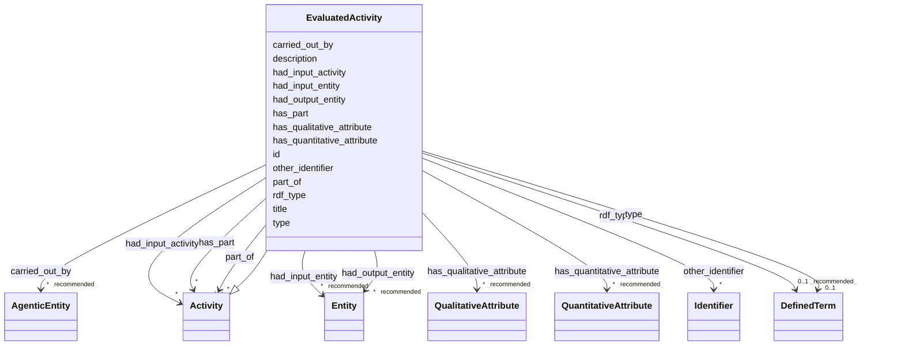

# Class: EvaluatedActivity 


_An activity or proces that is being evaluated in a DataGeneratingActivity._


URI: [prov:Activity](http://www.w3.org/ns/prov#Activity)





## Inheritance
* [Activity](../classes/Activity.md) [ [ClassifierMixin](../classes/ClassifierMixin.md)]
    * **EvaluatedActivity**


## Slots

| Name | Cardinality and Range | Description | Inheritance |
| ---  | --- | --- | --- |
| [id](../slots/id.md) | 1 <br/> [Uriorcurie](../types/Uriorcurie.md) | A slot to provide an URI for an entity within this schema. | [Activity](../classes/Activity.md) |
| [title](../slots/title.md) | * <br/> [String](../types/String.md) | The slot to provide a title for the Activity. | [Activity](../classes/Activity.md) |
| [description](../slots/description.md) | * <br/> [String](../types/String.md) | The slot to provide a description for the Activity. | [Activity](../classes/Activity.md) |
| [other_identifier](../slots/other_identifier.md) | * <br/> [Identifier](../classes/Identifier.md) | A slot to provide a secondary identifier of the EvaluatedActivity. | [Activity](../classes/Activity.md) |
| [has_part](../slots/has_part.md) | * <br/> [Activity](../classes/Activity.md) | The slot to provide an Activity that is part of the Activity. | [Activity](../classes/Activity.md) |
| [had_input_entity](../slots/had_input_entity.md) | * _recommended_ <br/> [Entity](../classes/Entity.md) | The slot to specify the Entity that was used as an input of an Activity that is to be changed, consumed or transformed. | [Activity](../classes/Activity.md) |
| [had_output_entity](../slots/had_output_entity.md) | * _recommended_ <br/> [Entity](../classes/Entity.md) | The slot to specify the Entity that was generated as an output of an Activity. | [Activity](../classes/Activity.md) |
| [had_input_activity](../slots/had_input_activity.md) | * _recommended_ <br/> [Activity](../classes/Activity.md) | The slot to provide a previous Activity that informed the Activity by being causally via a shared participant. | [Activity](../classes/Activity.md) |
| [carried_out_by](../slots/carried_out_by.md) | * _recommended_ <br/> [AgenticEntity](../classes/AgenticEntity.md) | The slot to specify the AgenticEntity that played a certain part in carrying out the Activity, either via having a specific role, function or disposition that was realized in the Activity. | [Activity](../classes/Activity.md) |
| [has_qualitative_attribute](../slots/has_qualitative_attribute.md) | * _recommended_ <br/> [QualitativeAttribute](../classes/QualitativeAttribute.md) | The slot to relate a qualitative attribute to an EvaluatedEntity, EvaluatedActivity or AgenticEntity | [Activity](../classes/Activity.md) |
| [has_quantitative_attribute](../slots/has_quantitative_attribute.md) | * _recommended_ <br/> [QuantitativeAttribute](../classes/QuantitativeAttribute.md) | The slot to relate a quantitative attribute to an EvaluatedEntity, EvaluatedActivity or AgenticEntity | [Activity](../classes/Activity.md) |
| [part_of](../slots/part_of.md) | * <br/> [Activity](../classes/Activity.md) | The slot to provide an Activity of which the Activity is a part. | [Activity](../classes/Activity.md) |
| [type](../slots/type.md) | 0..1 <br/> [DefinedTerm](../classes/DefinedTerm.md) | This slot is described in more detail within the class in which it is used. | [ClassifierMixin](../classes/ClassifierMixin.md) |
| [rdf_type](../slots/rdf_type.md) | 0..1 _recommended_ <br/> [DefinedTerm](../classes/DefinedTerm.md) | The slot to specify the ontology class that is instantiated by an entity. | [ClassifierMixin](../classes/ClassifierMixin.md) |


## Usages

| used by | used in | type | used |
| ---  | --- | --- | --- |
| [AnalysisDataset](../classes/AnalysisDataset.md) | [is_about_activity](../slots/is_about_activity.md) | range | [EvaluatedActivity](../classes/EvaluatedActivity.md) |
| [DataAnalysis](../classes/DataAnalysis.md) | [evaluated_activity](../slots/evaluated_activity.md) | range | [EvaluatedActivity](../classes/EvaluatedActivity.md) |
| [DataGeneratingActivity](../classes/DataGeneratingActivity.md) | [evaluated_activity](../slots/evaluated_activity.md) | range | [EvaluatedActivity](../classes/EvaluatedActivity.md) |
| [Dataset](../classes/Dataset.md) | [is_about_activity](../slots/is_about_activity.md) | range | [EvaluatedActivity](../classes/EvaluatedActivity.md) |


## Identifier and Mapping Information


### Schema Source


* from schema: https://nfdi-de.github.io/dcat-ap-plus/dcat_ap_plus.yaml


## Mappings

| Mapping Type | Mapped Value |
| ---  | ---  |
| self | prov:Activity |
| native | dcatap_plus:EvaluatedActivity |


## LinkML Source

<!-- TODO: investigate https://stackoverflow.com/questions/37606292/how-to-create-tabbed-code-blocks-in-mkdocs-or-sphinx -->

### Direct

<details>
```yaml
name: EvaluatedActivity
description: An activity or proces that is being evaluated in a DataGeneratingActivity.
in_subset:
- domain_agnostic_core
from_schema: https://nfdi-de.github.io/dcat-ap-plus/dcat_ap_plus.yaml
is_a: Activity
slot_usage:
  other_identifier:
    name: other_identifier
    description: A slot to provide a secondary identifier of the EvaluatedActivity.
    range: Identifier
    required: false
    multivalued: true
    inlined_as_list: true
class_uri: prov:Activity

```
</details>

### Induced

<details>
```yaml
name: EvaluatedActivity
description: An activity or proces that is being evaluated in a DataGeneratingActivity.
in_subset:
- domain_agnostic_core
from_schema: https://nfdi-de.github.io/dcat-ap-plus/dcat_ap_plus.yaml
is_a: Activity
slot_usage:
  other_identifier:
    name: other_identifier
    description: A slot to provide a secondary identifier of the EvaluatedActivity.
    range: Identifier
    required: false
    multivalued: true
    inlined_as_list: true
attributes:
  id:
    name: id
    description: A slot to provide an URI for an entity within this schema.
    in_subset:
    - domain_agnostic_core
    from_schema: https://nfdi-de.github.io/dcat-ap-plus/dcat_ap_plus.yaml
    rank: 1000
    identifier: true
    alias: id
    owner: EvaluatedActivity
    domain_of:
    - Activity
    - AgenticEntity
    - Dataset
    - DefinedTerm
    - Document
    - Entity
    - LegalResource
    - LicenseDocument
    - Resource
    range: uriorcurie
    required: true
  title:
    name: title
    description: The slot to provide a title for the Activity.
    notes:
    - not in DCAT-AP
    from_schema: https://nfdi-de.github.io/dcat-ap-plus/dcat_ap_plus.yaml
    rank: 1000
    slot_uri: dcterms:title
    alias: title
    owner: EvaluatedActivity
    domain_of:
    - Activity
    - AgenticEntity
    - Any
    - Attribution
    - Catalogue
    - CatalogueRecord
    - ChecksumAlgorithm
    - Concept
    - ConceptScheme
    - DataService
    - Dataset
    - DatasetSeries
    - DefinedTerm
    - Distribution
    - Document
    - Entity
    - Frequency
    - Geometry
    - Identifier
    - LegalResource
    - LicenseDocument
    - LinguisticSystem
    - MediaType
    - MediaTypeOrExtent
    - PeriodOfTime
    - Plan
    - Policy
    - ProvenanceStatement
    - QualitativeAttribute
    - QuantitativeAttribute
    - Resource
    - RightsStatement
    - Role
    - Standard
    - SupportiveEntity
    - Surrounding
    - TimeInstant
    range: string
    multivalued: true
    inlined_as_list: true
  description:
    name: description
    description: The slot to provide a description for the Activity.
    notes:
    - not in DCAT-AP
    from_schema: https://nfdi-de.github.io/dcat-ap-plus/dcat_ap_plus.yaml
    rank: 1000
    slot_uri: dcterms:description
    alias: description
    owner: EvaluatedActivity
    domain_of:
    - Activity
    - AgenticEntity
    - Any
    - Attribution
    - Catalogue
    - CatalogueRecord
    - ChecksumAlgorithm
    - Concept
    - ConceptScheme
    - DataService
    - Dataset
    - DatasetSeries
    - Distribution
    - Document
    - Entity
    - Frequency
    - Geometry
    - Identifier
    - LegalResource
    - LicenseDocument
    - LinguisticSystem
    - MediaType
    - MediaTypeOrExtent
    - PeriodOfTime
    - Plan
    - Policy
    - ProvenanceStatement
    - QualitativeAttribute
    - QuantitativeAttribute
    - Resource
    - RightsStatement
    - Role
    - Standard
    - SupportiveEntity
    - Surrounding
    - TimeInstant
    range: string
    multivalued: true
    inlined_as_list: true
  other_identifier:
    name: other_identifier
    description: A slot to provide a secondary identifier of the EvaluatedActivity.
    notes:
    - not in DCAT-AP
    from_schema: https://nfdi-de.github.io/dcat-ap-plus/dcat_ap_plus.yaml
    rank: 1000
    slot_uri: adms:identifier
    alias: other_identifier
    owner: EvaluatedActivity
    domain_of:
    - Activity
    - AgenticEntity
    - Dataset
    - Entity
    range: Identifier
    required: false
    multivalued: true
    inlined_as_list: true
  has_part:
    name: has_part
    description: The slot to provide an Activity that is part of the Activity.
    notes:
    - not in DCAT-AP
    from_schema: https://nfdi-de.github.io/dcat-ap-plus/dcat_ap_plus.yaml
    rank: 1000
    slot_uri: dcterms:hasPart
    alias: has_part
    owner: EvaluatedActivity
    domain_of:
    - Activity
    - AgenticEntity
    - Catalogue
    - Entity
    range: Activity
    multivalued: true
    inlined_as_list: true
  had_input_entity:
    name: had_input_entity
    description: The slot to specify the Entity that was used as an input of an Activity
      that is to be changed, consumed or transformed.
    notes:
    - not in DCAT-AP
    in_subset:
    - domain_agnostic_core
    from_schema: https://nfdi-de.github.io/dcat-ap-plus/dcat_ap_plus.yaml
    rank: 1000
    slot_uri: prov:used
    alias: had_input_entity
    owner: EvaluatedActivity
    domain_of:
    - Activity
    range: Entity
    recommended: true
    multivalued: true
    inlined: true
    inlined_as_list: true
  had_output_entity:
    name: had_output_entity
    description: The slot to specify the Entity that was generated as an output of
      an Activity.
    notes:
    - not in DCAT-AP
    in_subset:
    - domain_agnostic_core
    from_schema: https://nfdi-de.github.io/dcat-ap-plus/dcat_ap_plus.yaml
    rank: 1000
    slot_uri: prov:generated
    alias: had_output_entity
    owner: EvaluatedActivity
    domain_of:
    - Activity
    range: Entity
    recommended: true
    multivalued: true
    inlined: true
    inlined_as_list: true
  had_input_activity:
    name: had_input_activity
    description: The slot to provide a previous Activity that informed the Activity
      by being causally via a shared participant.
    notes:
    - not in DCAT-AP
    in_subset:
    - domain_agnostic_core
    from_schema: https://nfdi-de.github.io/dcat-ap-plus/dcat_ap_plus.yaml
    rank: 1000
    slot_uri: prov:wasInformedBy
    alias: had_input_activity
    owner: EvaluatedActivity
    domain_of:
    - Activity
    range: Activity
    recommended: true
    multivalued: true
    inlined: true
    inlined_as_list: true
  carried_out_by:
    name: carried_out_by
    description: The slot to specify the AgenticEntity that played a certain part
      in carrying out the Activity, either via having a specific role, function or
      disposition that was realized in the Activity.
    notes:
    - not in DCAT-AP
    in_subset:
    - domain_agnostic_core
    from_schema: https://nfdi-de.github.io/dcat-ap-plus/dcat_ap_plus.yaml
    rank: 1000
    slot_uri: prov:wasAssociatedWith
    alias: carried_out_by
    owner: EvaluatedActivity
    domain_of:
    - Activity
    range: AgenticEntity
    recommended: true
    multivalued: true
    inlined: true
    inlined_as_list: true
  has_qualitative_attribute:
    name: has_qualitative_attribute
    description: The slot to relate a qualitative attribute to an EvaluatedEntity,
      EvaluatedActivity or AgenticEntity
    notes:
    - not in DCAT-AP
    in_subset:
    - domain_agnostic_core
    from_schema: https://nfdi-de.github.io/dcat-ap-plus/dcat_ap_plus.yaml
    rank: 1000
    slot_uri: dcterms:relation
    alias: has_qualitative_attribute
    owner: EvaluatedActivity
    domain_of:
    - Activity
    - AgenticEntity
    - Entity
    range: QualitativeAttribute
    recommended: true
    multivalued: true
    inlined: true
    inlined_as_list: true
  has_quantitative_attribute:
    name: has_quantitative_attribute
    description: The slot to relate a quantitative attribute to an EvaluatedEntity,
      EvaluatedActivity or AgenticEntity
    notes:
    - not in DCAT-AP
    in_subset:
    - domain_agnostic_core
    from_schema: https://nfdi-de.github.io/dcat-ap-plus/dcat_ap_plus.yaml
    rank: 1000
    slot_uri: dcterms:relation
    alias: has_quantitative_attribute
    owner: EvaluatedActivity
    domain_of:
    - Activity
    - AgenticEntity
    - Entity
    range: QuantitativeAttribute
    recommended: true
    multivalued: true
    inlined: true
    inlined_as_list: true
  part_of:
    name: part_of
    description: The slot to provide an Activity of which the Activity is a part.
    notes:
    - not in DCAT-AP
    in_subset:
    - domain_agnostic_core
    from_schema: https://nfdi-de.github.io/dcat-ap-plus/dcat_ap_plus.yaml
    rank: 1000
    slot_uri: dcterms:isPartOf
    alias: part_of
    owner: EvaluatedActivity
    domain_of:
    - Activity
    - AgenticEntity
    - Entity
    inverse: has_part
    range: Activity
    multivalued: true
    inlined_as_list: true
  type:
    name: type
    description: This slot is described in more detail within the class in which it
      is used.
    from_schema: https://nfdi-de.github.io/dcat-ap-plus/dcat_ap_plus.yaml
    rank: 1000
    slot_uri: dcterms:type
    alias: type
    owner: EvaluatedActivity
    domain_of:
    - Agent
    - ClassifierMixin
    - Dataset
    - LicenseDocument
    range: DefinedTerm
    inlined: true
  rdf_type:
    name: rdf_type
    description: The slot to specify the ontology class that is instantiated by an
      entity.
    in_subset:
    - domain_agnostic_core
    from_schema: https://nfdi-de.github.io/dcat-ap-plus/dcat_ap_plus.yaml
    rank: 1000
    slot_uri: rdf:type
    alias: rdf_type
    owner: EvaluatedActivity
    domain_of:
    - ClassifierMixin
    range: DefinedTerm
    recommended: true
    inlined: true
class_uri: prov:Activity

```
</details>