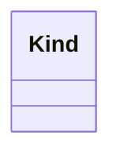

# Class: Kind 


_See [DCAT-AP specs:Kind](https://semiceu.github.io/DCAT-AP/releases/3.0.0/#Kind)_


URI: [vcard:Kind](http://www.w3.org/2006/vcard/ns#Kind)





<!-- no inheritance hierarchy -->


## Slots

| Name | Cardinality and Range | Description | Inheritance |
| ---  | --- | --- | --- |


## Usages

| used by | used in | type | used |
| ---  | --- | --- | --- |
| [AnalysisDataset](../classes/AnalysisDataset.md) | [contact_point](../slots/contact_point.md) | range | [Kind](../classes/Kind.md) |
| [DataService](../classes/DataService.md) | [contact_point](../slots/contact_point.md) | range | [Kind](../classes/Kind.md) |
| [Dataset](../classes/Dataset.md) | [contact_point](../slots/contact_point.md) | range | [Kind](../classes/Kind.md) |
| [DatasetSeries](../classes/DatasetSeries.md) | [contact_point](../slots/contact_point.md) | range | [Kind](../classes/Kind.md) |


## Identifier and Mapping Information


### Schema Source


* from schema: https://nfdi-de.github.io/dcat-ap-plus/dcat_ap_plus.yaml


## Mappings

| Mapping Type | Mapped Value |
| ---  | ---  |
| self | vcard:Kind |
| native | dcatap_plus:Kind |


## LinkML Source

<!-- TODO: investigate https://stackoverflow.com/questions/37606292/how-to-create-tabbed-code-blocks-in-mkdocs-or-sphinx -->

### Direct

<details>
```yaml
name: Kind
description: See [DCAT-AP specs:Kind](https://semiceu.github.io/DCAT-AP/releases/3.0.0/#Kind)
from_schema: https://nfdi-de.github.io/dcat-ap-plus/dcat_ap_plus.yaml
class_uri: vcard:Kind

```
</details>

### Induced

<details>
```yaml
name: Kind
description: See [DCAT-AP specs:Kind](https://semiceu.github.io/DCAT-AP/releases/3.0.0/#Kind)
from_schema: https://nfdi-de.github.io/dcat-ap-plus/dcat_ap_plus.yaml
class_uri: vcard:Kind

```
</details>