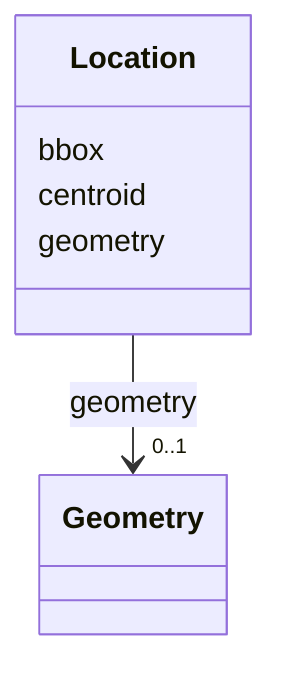

# Class: Location 


_See [DCAT-AP specs:Location](https://semiceu.github.io/DCAT-AP/releases/3.0.0/#Location)_


URI: [dcterms:Location](http://purl.org/dc/terms/Location)





<!-- no inheritance hierarchy -->


## Slots

| Name | Cardinality and Range | Description | Inheritance |
| ---  | --- | --- | --- |
| [bbox](../slots/bbox.md) | 0..1 _recommended_ <br/> [String](../types/String.md) | The geographic bounding box of a resource. | direct |
| [centroid](../slots/centroid.md) | 0..1 _recommended_ <br/> [String](../types/String.md) | The geographic center (centroid) of a resource. | direct |
| [geometry](../slots/geometry.md) | 0..1 <br/> [Geometry](../classes/Geometry.md) | The corresponding geometry for a resource. | direct |


## Usages

| used by | used in | type | used |
| ---  | --- | --- | --- |
| [AnalysisDataset](../classes/AnalysisDataset.md) | [geographical_coverage](../slots/geographical_coverage.md) | range | [Location](../classes/Location.md) |
| [Catalogue](../classes/Catalogue.md) | [geographical_coverage](../slots/geographical_coverage.md) | range | [Location](../classes/Location.md) |
| [Dataset](../classes/Dataset.md) | [geographical_coverage](../slots/geographical_coverage.md) | range | [Location](../classes/Location.md) |
| [DatasetSeries](../classes/DatasetSeries.md) | [geographical_coverage](../slots/geographical_coverage.md) | range | [Location](../classes/Location.md) |


## Identifier and Mapping Information


### Schema Source


* from schema: https://nfdi-de.github.io/dcat-ap-plus/dcat_ap_plus.yaml


## Mappings

| Mapping Type | Mapped Value |
| ---  | ---  |
| self | dcterms:Location |
| native | dcatap_plus:Location |


## LinkML Source

<!-- TODO: investigate https://stackoverflow.com/questions/37606292/how-to-create-tabbed-code-blocks-in-mkdocs-or-sphinx -->

### Direct

<details>
```yaml
name: Location
description: See [DCAT-AP specs:Location](https://semiceu.github.io/DCAT-AP/releases/3.0.0/#Location)
from_schema: https://nfdi-de.github.io/dcat-ap-plus/dcat_ap_plus.yaml
slots:
- bbox
- centroid
- geometry
slot_usage:
  bbox:
    name: bbox
    description: The geographic bounding box of a resource.
    slot_uri: dcat:bbox
    range: string
    required: false
    recommended: true
    multivalued: false
    inlined_as_list: false
  centroid:
    name: centroid
    description: The geographic center (centroid) of a resource.
    slot_uri: dcat:centroid
    range: string
    required: false
    recommended: true
    multivalued: false
    inlined_as_list: false
  geometry:
    name: geometry
    description: The corresponding geometry for a resource.
    slot_uri: locn:geometry
    range: Geometry
    required: false
    multivalued: false
    inlined_as_list: false
class_uri: dcterms:Location

```
</details>

### Induced

<details>
```yaml
name: Location
description: See [DCAT-AP specs:Location](https://semiceu.github.io/DCAT-AP/releases/3.0.0/#Location)
from_schema: https://nfdi-de.github.io/dcat-ap-plus/dcat_ap_plus.yaml
slot_usage:
  bbox:
    name: bbox
    description: The geographic bounding box of a resource.
    slot_uri: dcat:bbox
    range: string
    required: false
    recommended: true
    multivalued: false
    inlined_as_list: false
  centroid:
    name: centroid
    description: The geographic center (centroid) of a resource.
    slot_uri: dcat:centroid
    range: string
    required: false
    recommended: true
    multivalued: false
    inlined_as_list: false
  geometry:
    name: geometry
    description: The corresponding geometry for a resource.
    slot_uri: locn:geometry
    range: Geometry
    required: false
    multivalued: false
    inlined_as_list: false
attributes:
  bbox:
    name: bbox
    description: The geographic bounding box of a resource.
    from_schema: https://nfdi-de.github.io/dcat-ap-plus/dcat_ap_plus.yaml
    rank: 1000
    slot_uri: dcat:bbox
    alias: bbox
    owner: Location
    domain_of:
    - Location
    range: string
    required: false
    recommended: true
    multivalued: false
    inlined_as_list: false
  centroid:
    name: centroid
    description: The geographic center (centroid) of a resource.
    from_schema: https://nfdi-de.github.io/dcat-ap-plus/dcat_ap_plus.yaml
    rank: 1000
    slot_uri: dcat:centroid
    alias: centroid
    owner: Location
    domain_of:
    - Location
    range: string
    required: false
    recommended: true
    multivalued: false
    inlined_as_list: false
  geometry:
    name: geometry
    description: The corresponding geometry for a resource.
    from_schema: https://nfdi-de.github.io/dcat-ap-plus/dcat_ap_plus.yaml
    rank: 1000
    slot_uri: locn:geometry
    alias: geometry
    owner: Location
    domain_of:
    - Location
    range: Geometry
    required: false
    multivalued: false
    inlined_as_list: false
class_uri: dcterms:Location

```
</details>