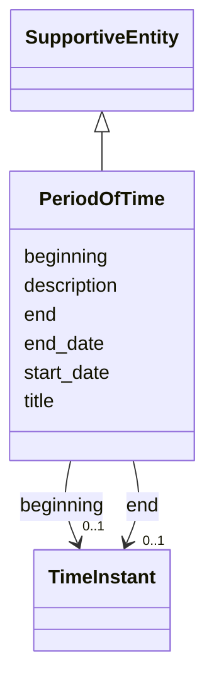

# Class: PeriodOfTime 


_See [DCAT-AP specs:PeriodOfTime](https://semiceu.github.io/DCAT-AP/releases/3.0.0/#PeriodOfTime)_


URI: [dcterms:PeriodOfTime](http://purl.org/dc/terms/PeriodOfTime)





## Inheritance
* [SupportiveEntity](../classes/SupportiveEntity.md)
    * **PeriodOfTime**


## Slots

| Name | Cardinality and Range | Description | Inheritance |
| ---  | --- | --- | --- |
| [beginning](../slots/beginning.md) | 0..1 <br/> [TimeInstant](../classes/TimeInstant.md) | The beginning of a period or interval. | direct |
| [end](../slots/end.md) | 0..1 <br/> [TimeInstant](../classes/TimeInstant.md) | The end of a period or interval. | direct |
| [end_date](../slots/end_date.md) | 0..1 _recommended_ <br/> [Date](../types/Date.md) | The end of the period. | direct |
| [start_date](../slots/start_date.md) | 0..1 _recommended_ <br/> [Date](../types/Date.md) | The start of the period. | direct |
| [title](../slots/title.md) | 0..1 <br/> [String](../types/String.md) | This slot is described in more detail within the class in which it is used. | direct |
| [description](../slots/description.md) | 0..1 <br/> [String](../types/String.md) | This slot is described in more detail within the class in which it is used. | direct |


## Usages

| used by | used in | type | used |
| ---  | --- | --- | --- |
| [AnalysisDataset](../classes/AnalysisDataset.md) | [temporal_coverage](../slots/temporal_coverage.md) | range | [PeriodOfTime](../classes/PeriodOfTime.md) |
| [Catalogue](../classes/Catalogue.md) | [temporal_coverage](../slots/temporal_coverage.md) | range | [PeriodOfTime](../classes/PeriodOfTime.md) |
| [Dataset](../classes/Dataset.md) | [temporal_coverage](../slots/temporal_coverage.md) | range | [PeriodOfTime](../classes/PeriodOfTime.md) |
| [DatasetSeries](../classes/DatasetSeries.md) | [temporal_coverage](../slots/temporal_coverage.md) | range | [PeriodOfTime](../classes/PeriodOfTime.md) |


## Identifier and Mapping Information


### Schema Source


* from schema: https://nfdi-de.github.io/dcat-ap-plus/dcat_ap_plus.yaml


## Mappings

| Mapping Type | Mapped Value |
| ---  | ---  |
| self | dcterms:PeriodOfTime |
| native | dcatap_plus:PeriodOfTime |


## LinkML Source

<!-- TODO: investigate https://stackoverflow.com/questions/37606292/how-to-create-tabbed-code-blocks-in-mkdocs-or-sphinx -->

### Direct

<details>
```yaml
name: PeriodOfTime
description: See [DCAT-AP specs:PeriodOfTime](https://semiceu.github.io/DCAT-AP/releases/3.0.0/#PeriodOfTime)
from_schema: https://nfdi-de.github.io/dcat-ap-plus/dcat_ap_plus.yaml
is_a: SupportiveEntity
slots:
- beginning
- end
- end_date
- start_date
- title
- description
slot_usage:
  beginning:
    name: beginning
    description: The beginning of a period or interval.
    slot_uri: time:hasBeginning
    range: TimeInstant
    required: false
    multivalued: false
    inlined_as_list: true
  end:
    name: end
    description: The end of a period or interval.
    slot_uri: time:hasEnd
    range: TimeInstant
    required: false
    multivalued: false
    inlined_as_list: true
  end_date:
    name: end_date
    description: The end of the period.
    slot_uri: dcat:endDate
    range: date
    required: false
    recommended: true
    multivalued: false
    inlined_as_list: true
  start_date:
    name: start_date
    description: The start of the period.
    slot_uri: dcat:startDate
    range: date
    required: false
    recommended: true
    multivalued: false
    inlined_as_list: false
class_uri: dcterms:PeriodOfTime

```
</details>

### Induced

<details>
```yaml
name: PeriodOfTime
description: See [DCAT-AP specs:PeriodOfTime](https://semiceu.github.io/DCAT-AP/releases/3.0.0/#PeriodOfTime)
from_schema: https://nfdi-de.github.io/dcat-ap-plus/dcat_ap_plus.yaml
is_a: SupportiveEntity
slot_usage:
  beginning:
    name: beginning
    description: The beginning of a period or interval.
    slot_uri: time:hasBeginning
    range: TimeInstant
    required: false
    multivalued: false
    inlined_as_list: true
  end:
    name: end
    description: The end of a period or interval.
    slot_uri: time:hasEnd
    range: TimeInstant
    required: false
    multivalued: false
    inlined_as_list: true
  end_date:
    name: end_date
    description: The end of the period.
    slot_uri: dcat:endDate
    range: date
    required: false
    recommended: true
    multivalued: false
    inlined_as_list: true
  start_date:
    name: start_date
    description: The start of the period.
    slot_uri: dcat:startDate
    range: date
    required: false
    recommended: true
    multivalued: false
    inlined_as_list: false
attributes:
  beginning:
    name: beginning
    description: The beginning of a period or interval.
    from_schema: https://nfdi-de.github.io/dcat-ap-plus/dcat_ap_plus.yaml
    rank: 1000
    slot_uri: time:hasBeginning
    alias: beginning
    owner: PeriodOfTime
    domain_of:
    - PeriodOfTime
    range: TimeInstant
    required: false
    multivalued: false
    inlined_as_list: true
  end:
    name: end
    description: The end of a period or interval.
    from_schema: https://nfdi-de.github.io/dcat-ap-plus/dcat_ap_plus.yaml
    rank: 1000
    slot_uri: time:hasEnd
    alias: end
    owner: PeriodOfTime
    domain_of:
    - PeriodOfTime
    range: TimeInstant
    required: false
    multivalued: false
    inlined_as_list: true
  end_date:
    name: end_date
    description: The end of the period.
    from_schema: https://nfdi-de.github.io/dcat-ap-plus/dcat_ap_plus.yaml
    rank: 1000
    slot_uri: dcat:endDate
    alias: end_date
    owner: PeriodOfTime
    domain_of:
    - PeriodOfTime
    range: date
    required: false
    recommended: true
    multivalued: false
    inlined_as_list: true
  start_date:
    name: start_date
    description: The start of the period.
    from_schema: https://nfdi-de.github.io/dcat-ap-plus/dcat_ap_plus.yaml
    rank: 1000
    slot_uri: dcat:startDate
    alias: start_date
    owner: PeriodOfTime
    domain_of:
    - PeriodOfTime
    range: date
    required: false
    recommended: true
    multivalued: false
    inlined_as_list: false
  title:
    name: title
    description: This slot is described in more detail within the class in which it
      is used.
    from_schema: https://nfdi-de.github.io/dcat-ap-plus/dcat_ap_plus.yaml
    rank: 1000
    slot_uri: dcterms:title
    alias: title
    owner: PeriodOfTime
    domain_of:
    - Activity
    - AgenticEntity
    - Any
    - Attribution
    - Catalogue
    - CatalogueRecord
    - ChecksumAlgorithm
    - Concept
    - ConceptScheme
    - DataService
    - Dataset
    - DatasetSeries
    - DefinedTerm
    - Distribution
    - Document
    - Entity
    - Frequency
    - Geometry
    - Identifier
    - LegalResource
    - LicenseDocument
    - LinguisticSystem
    - MediaType
    - MediaTypeOrExtent
    - PeriodOfTime
    - Plan
    - Policy
    - ProvenanceStatement
    - QualitativeAttribute
    - QuantitativeAttribute
    - Resource
    - RightsStatement
    - Role
    - Standard
    - SupportiveEntity
    - Surrounding
    - TimeInstant
    range: string
  description:
    name: description
    description: This slot is described in more detail within the class in which it
      is used.
    from_schema: https://nfdi-de.github.io/dcat-ap-plus/dcat_ap_plus.yaml
    rank: 1000
    slot_uri: dcterms:description
    alias: description
    owner: PeriodOfTime
    domain_of:
    - Activity
    - AgenticEntity
    - Any
    - Attribution
    - Catalogue
    - CatalogueRecord
    - ChecksumAlgorithm
    - Concept
    - ConceptScheme
    - DataService
    - Dataset
    - DatasetSeries
    - Distribution
    - Document
    - Entity
    - Frequency
    - Geometry
    - Identifier
    - LegalResource
    - LicenseDocument
    - LinguisticSystem
    - MediaType
    - MediaTypeOrExtent
    - PeriodOfTime
    - Plan
    - Policy
    - ProvenanceStatement
    - QualitativeAttribute
    - QuantitativeAttribute
    - Resource
    - RightsStatement
    - Role
    - Standard
    - SupportiveEntity
    - Surrounding
    - TimeInstant
    range: string
class_uri: dcterms:PeriodOfTime

```
</details>