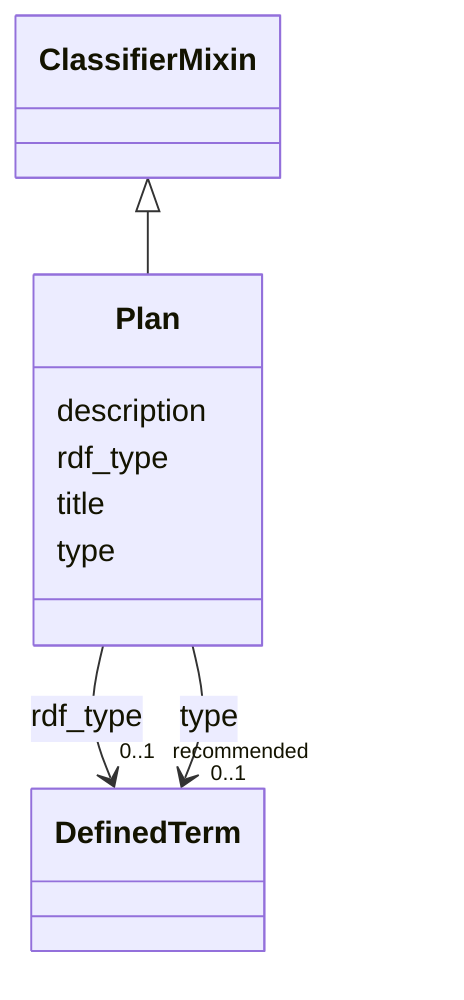

# Class: Plan 


_A piece of information that specifies how an activity has to be carried out by its agents including what kind of steps have to be taken and what kind of parameters have to be met/set._


URI: [prov:Plan](http://www.w3.org/ns/prov#Plan)





## Inheritance
* **Plan** [ [ClassifierMixin](../classes/ClassifierMixin.md)]


## Slots

| Name | Cardinality and Range | Description | Inheritance |
| ---  | --- | --- | --- |
| [title](../slots/title.md) | 0..1 <br/> [String](../types/String.md) | This slot is described in more detail within the class in which it is used. | direct |
| [description](../slots/description.md) | 0..1 <br/> [String](../types/String.md) | This slot is described in more detail within the class in which it is used. | direct |
| [type](../slots/type.md) | 0..1 <br/> [DefinedTerm](../classes/DefinedTerm.md) | This slot is described in more detail within the class in which it is used. | [ClassifierMixin](../classes/ClassifierMixin.md) |
| [rdf_type](../slots/rdf_type.md) | 0..1 _recommended_ <br/> [DefinedTerm](../classes/DefinedTerm.md) | The slot to specify the ontology class that is instantiated by an entity. | [ClassifierMixin](../classes/ClassifierMixin.md) |


## Usages

| used by | used in | type | used |
| ---  | --- | --- | --- |
| [DataAnalysis](../classes/DataAnalysis.md) | [realized_plan](../slots/realized_plan.md) | range | [Plan](../classes/Plan.md) |
| [DataGeneratingActivity](../classes/DataGeneratingActivity.md) | [realized_plan](../slots/realized_plan.md) | range | [Plan](../classes/Plan.md) |


## Aliases


* Plan Specification
* Method
* Procedure


## Examples

| Value |
| --- |
| None |

## Identifier and Mapping Information


### Schema Source


* from schema: https://nfdi-de.github.io/dcat-ap-plus/dcat_ap_plus.yaml


## Mappings

| Mapping Type | Mapped Value |
| ---  | ---  |
| self | prov:Plan |
| native | dcatap_plus:Plan |


## LinkML Source

<!-- TODO: investigate https://stackoverflow.com/questions/37606292/how-to-create-tabbed-code-blocks-in-mkdocs-or-sphinx -->

### Direct

<details>
```yaml
name: Plan
description: A piece of information that specifies how an activity has to be carried
  out by its agents including what kind of steps have to be taken and what kind of
  parameters have to be met/set.
examples:
- description: 'We assigned the structure of sample CRS-37013 using a 13C NMR (CHMO:0000595)
    and the settings: pulse sequence: zgpg30, temperature: 298.0 K, number of scans:
    1024, Solvent : chloroform-D1 (CDCl3).'
in_subset:
- domain_agnostic_core
from_schema: https://nfdi-de.github.io/dcat-ap-plus/dcat_ap_plus.yaml
aliases:
- Plan Specification
- Method
- Procedure
mixins:
- ClassifierMixin
slots:
- title
- description
class_uri: prov:Plan

```
</details>

### Induced

<details>
```yaml
name: Plan
description: A piece of information that specifies how an activity has to be carried
  out by its agents including what kind of steps have to be taken and what kind of
  parameters have to be met/set.
examples:
- description: 'We assigned the structure of sample CRS-37013 using a 13C NMR (CHMO:0000595)
    and the settings: pulse sequence: zgpg30, temperature: 298.0 K, number of scans:
    1024, Solvent : chloroform-D1 (CDCl3).'
in_subset:
- domain_agnostic_core
from_schema: https://nfdi-de.github.io/dcat-ap-plus/dcat_ap_plus.yaml
aliases:
- Plan Specification
- Method
- Procedure
mixins:
- ClassifierMixin
attributes:
  title:
    name: title
    description: This slot is described in more detail within the class in which it
      is used.
    from_schema: https://nfdi-de.github.io/dcat-ap-plus/dcat_ap_plus.yaml
    rank: 1000
    slot_uri: dcterms:title
    alias: title
    owner: Plan
    domain_of:
    - Activity
    - AgenticEntity
    - Any
    - Attribution
    - Catalogue
    - CatalogueRecord
    - ChecksumAlgorithm
    - Concept
    - ConceptScheme
    - DataService
    - Dataset
    - DatasetSeries
    - DefinedTerm
    - Distribution
    - Document
    - Entity
    - Frequency
    - Geometry
    - Identifier
    - LegalResource
    - LicenseDocument
    - LinguisticSystem
    - MediaType
    - MediaTypeOrExtent
    - PeriodOfTime
    - Plan
    - Policy
    - ProvenanceStatement
    - QualitativeAttribute
    - QuantitativeAttribute
    - Resource
    - RightsStatement
    - Role
    - Standard
    - SupportiveEntity
    - Surrounding
    - TimeInstant
    range: string
  description:
    name: description
    description: This slot is described in more detail within the class in which it
      is used.
    from_schema: https://nfdi-de.github.io/dcat-ap-plus/dcat_ap_plus.yaml
    rank: 1000
    slot_uri: dcterms:description
    alias: description
    owner: Plan
    domain_of:
    - Activity
    - AgenticEntity
    - Any
    - Attribution
    - Catalogue
    - CatalogueRecord
    - ChecksumAlgorithm
    - Concept
    - ConceptScheme
    - DataService
    - Dataset
    - DatasetSeries
    - Distribution
    - Document
    - Entity
    - Frequency
    - Geometry
    - Identifier
    - LegalResource
    - LicenseDocument
    - LinguisticSystem
    - MediaType
    - MediaTypeOrExtent
    - PeriodOfTime
    - Plan
    - Policy
    - ProvenanceStatement
    - QualitativeAttribute
    - QuantitativeAttribute
    - Resource
    - RightsStatement
    - Role
    - Standard
    - SupportiveEntity
    - Surrounding
    - TimeInstant
    range: string
  type:
    name: type
    description: This slot is described in more detail within the class in which it
      is used.
    from_schema: https://nfdi-de.github.io/dcat-ap-plus/dcat_ap_plus.yaml
    rank: 1000
    slot_uri: dcterms:type
    alias: type
    owner: Plan
    domain_of:
    - Agent
    - ClassifierMixin
    - Dataset
    - LicenseDocument
    range: DefinedTerm
    inlined: true
  rdf_type:
    name: rdf_type
    description: The slot to specify the ontology class that is instantiated by an
      entity.
    in_subset:
    - domain_agnostic_core
    from_schema: https://nfdi-de.github.io/dcat-ap-plus/dcat_ap_plus.yaml
    rank: 1000
    slot_uri: rdf:type
    alias: rdf_type
    owner: Plan
    domain_of:
    - ClassifierMixin
    range: DefinedTerm
    recommended: true
    inlined: true
class_uri: prov:Plan

```
</details>