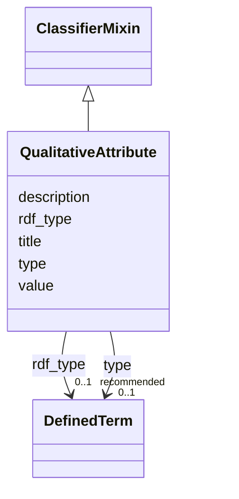

# Class: QualitativeAttribute 


_A piece of information that is attributed to an Entity, Activity or AgenticEntity._


URI: [prov:Entity](http://www.w3.org/ns/prov#Entity)





## Inheritance
* **QualitativeAttribute** [ [ClassifierMixin](../classes/ClassifierMixin.md)]


## Slots

| Name | Cardinality and Range | Description | Inheritance |
| ---  | --- | --- | --- |
| [title](../slots/title.md) | 0..1 <br/> [String](../types/String.md) | This slot is described in more detail within the class in which it is used. | direct |
| [description](../slots/description.md) | 0..1 <br/> [String](../types/String.md) | This slot is described in more detail within the class in which it is used. | direct |
| [value](../slots/value.md) | 1 <br/> [String](../types/String.md) | The slot to provide the literal value of the QualitativeAttribute. | direct |
| [type](../slots/type.md) | 0..1 <br/> [DefinedTerm](../classes/DefinedTerm.md) | This slot is described in more detail within the class in which it is used. | [ClassifierMixin](../classes/ClassifierMixin.md) |
| [rdf_type](../slots/rdf_type.md) | 0..1 _recommended_ <br/> [DefinedTerm](../classes/DefinedTerm.md) | The slot to specify the ontology class that is instantiated by an entity. | [ClassifierMixin](../classes/ClassifierMixin.md) |


## Usages

| used by | used in | type | used |
| ---  | --- | --- | --- |
| [Activity](../classes/Activity.md) | [has_qualitative_attribute](../slots/has_qualitative_attribute.md) | range | [QualitativeAttribute](../classes/QualitativeAttribute.md) |
| [AgenticEntity](../classes/AgenticEntity.md) | [has_qualitative_attribute](../slots/has_qualitative_attribute.md) | range | [QualitativeAttribute](../classes/QualitativeAttribute.md) |
| [AnalysisSourceData](../classes/AnalysisSourceData.md) | [has_qualitative_attribute](../slots/has_qualitative_attribute.md) | range | [QualitativeAttribute](../classes/QualitativeAttribute.md) |
| [DataAnalysis](../classes/DataAnalysis.md) | [has_qualitative_attribute](../slots/has_qualitative_attribute.md) | range | [QualitativeAttribute](../classes/QualitativeAttribute.md) |
| [DataGeneratingActivity](../classes/DataGeneratingActivity.md) | [has_qualitative_attribute](../slots/has_qualitative_attribute.md) | range | [QualitativeAttribute](../classes/QualitativeAttribute.md) |
| [Device](../classes/Device.md) | [has_qualitative_attribute](../slots/has_qualitative_attribute.md) | range | [QualitativeAttribute](../classes/QualitativeAttribute.md) |
| [Entity](../classes/Entity.md) | [has_qualitative_attribute](../slots/has_qualitative_attribute.md) | range | [QualitativeAttribute](../classes/QualitativeAttribute.md) |
| [EvaluatedActivity](../classes/EvaluatedActivity.md) | [has_qualitative_attribute](../slots/has_qualitative_attribute.md) | range | [QualitativeAttribute](../classes/QualitativeAttribute.md) |
| [EvaluatedEntity](../classes/EvaluatedEntity.md) | [has_qualitative_attribute](../slots/has_qualitative_attribute.md) | range | [QualitativeAttribute](../classes/QualitativeAttribute.md) |
| [Software](../classes/Software.md) | [has_qualitative_attribute](../slots/has_qualitative_attribute.md) | range | [QualitativeAttribute](../classes/QualitativeAttribute.md) |


## Identifier and Mapping Information


### Schema Source


* from schema: https://nfdi-de.github.io/dcat-ap-plus/dcat_ap_plus.yaml


## Mappings

| Mapping Type | Mapped Value |
| ---  | ---  |
| self | prov:Entity |
| native | dcatap_plus:QualitativeAttribute |


## LinkML Source

<!-- TODO: investigate https://stackoverflow.com/questions/37606292/how-to-create-tabbed-code-blocks-in-mkdocs-or-sphinx -->

### Direct

<details>
```yaml
name: QualitativeAttribute
description: A piece of information that is attributed to an Entity, Activity or AgenticEntity.
in_subset:
- domain_agnostic_core
from_schema: https://nfdi-de.github.io/dcat-ap-plus/dcat_ap_plus.yaml
mixins:
- ClassifierMixin
slots:
- title
- description
- value
slot_usage:
  value:
    name: value
    description: The slot to provide the literal value of the QualitativeAttribute.
    required: true
class_uri: prov:Entity

```
</details>

### Induced

<details>
```yaml
name: QualitativeAttribute
description: A piece of information that is attributed to an Entity, Activity or AgenticEntity.
in_subset:
- domain_agnostic_core
from_schema: https://nfdi-de.github.io/dcat-ap-plus/dcat_ap_plus.yaml
mixins:
- ClassifierMixin
slot_usage:
  value:
    name: value
    description: The slot to provide the literal value of the QualitativeAttribute.
    required: true
attributes:
  title:
    name: title
    description: This slot is described in more detail within the class in which it
      is used.
    from_schema: https://nfdi-de.github.io/dcat-ap-plus/dcat_ap_plus.yaml
    rank: 1000
    slot_uri: dcterms:title
    alias: title
    owner: QualitativeAttribute
    domain_of:
    - Activity
    - AgenticEntity
    - Any
    - Attribution
    - Catalogue
    - CatalogueRecord
    - ChecksumAlgorithm
    - Concept
    - ConceptScheme
    - DataService
    - Dataset
    - DatasetSeries
    - DefinedTerm
    - Distribution
    - Document
    - Entity
    - Frequency
    - Geometry
    - Identifier
    - LegalResource
    - LicenseDocument
    - LinguisticSystem
    - MediaType
    - MediaTypeOrExtent
    - PeriodOfTime
    - Plan
    - Policy
    - ProvenanceStatement
    - QualitativeAttribute
    - QuantitativeAttribute
    - Resource
    - RightsStatement
    - Role
    - Standard
    - SupportiveEntity
    - Surrounding
    - TimeInstant
    range: string
  description:
    name: description
    description: This slot is described in more detail within the class in which it
      is used.
    from_schema: https://nfdi-de.github.io/dcat-ap-plus/dcat_ap_plus.yaml
    rank: 1000
    slot_uri: dcterms:description
    alias: description
    owner: QualitativeAttribute
    domain_of:
    - Activity
    - AgenticEntity
    - Any
    - Attribution
    - Catalogue
    - CatalogueRecord
    - ChecksumAlgorithm
    - Concept
    - ConceptScheme
    - DataService
    - Dataset
    - DatasetSeries
    - Distribution
    - Document
    - Entity
    - Frequency
    - Geometry
    - Identifier
    - LegalResource
    - LicenseDocument
    - LinguisticSystem
    - MediaType
    - MediaTypeOrExtent
    - PeriodOfTime
    - Plan
    - Policy
    - ProvenanceStatement
    - QualitativeAttribute
    - QuantitativeAttribute
    - Resource
    - RightsStatement
    - Role
    - Standard
    - SupportiveEntity
    - Surrounding
    - TimeInstant
    range: string
  value:
    name: value
    description: The slot to provide the literal value of the QualitativeAttribute.
    in_subset:
    - domain_agnostic_core
    from_schema: https://nfdi-de.github.io/dcat-ap-plus/dcat_ap_plus.yaml
    rank: 1000
    slot_uri: prov:value
    alias: value
    owner: QualitativeAttribute
    domain_of:
    - QualitativeAttribute
    - QuantitativeAttribute
    range: string
    required: true
  type:
    name: type
    description: This slot is described in more detail within the class in which it
      is used.
    from_schema: https://nfdi-de.github.io/dcat-ap-plus/dcat_ap_plus.yaml
    rank: 1000
    slot_uri: dcterms:type
    alias: type
    owner: QualitativeAttribute
    domain_of:
    - Agent
    - ClassifierMixin
    - Dataset
    - LicenseDocument
    range: DefinedTerm
    inlined: true
  rdf_type:
    name: rdf_type
    description: The slot to specify the ontology class that is instantiated by an
      entity.
    in_subset:
    - domain_agnostic_core
    from_schema: https://nfdi-de.github.io/dcat-ap-plus/dcat_ap_plus.yaml
    rank: 1000
    slot_uri: rdf:type
    alias: rdf_type
    owner: QualitativeAttribute
    domain_of:
    - ClassifierMixin
    range: DefinedTerm
    recommended: true
    inlined: true
class_uri: prov:Entity

```
</details>