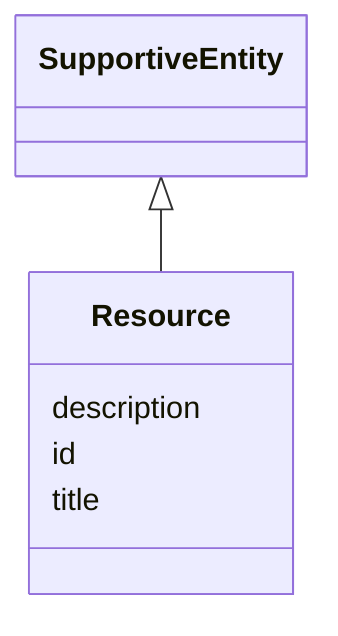

# Class: Resource 


_See [DCAT-AP specs:Resource](https://semiceu.github.io/DCAT-AP/releases/3.0.0/#Resource)_


URI: [rdfs:Resource](http://www.w3.org/2000/01/rdf-schema#Resource)





## Inheritance
* [SupportiveEntity](../classes/SupportiveEntity.md)
    * **Resource**


## Slots

| Name | Cardinality and Range | Description | Inheritance |
| ---  | --- | --- | --- |
| [id](../slots/id.md) | 1 <br/> [Uriorcurie](../types/Uriorcurie.md) | A slot to provide an URI for an entity within this schema. | direct |
| [title](../slots/title.md) | 0..1 <br/> [String](../types/String.md) | This slot is described in more detail within the class in which it is used. | direct |
| [description](../slots/description.md) | 0..1 <br/> [String](../types/String.md) | This slot is described in more detail within the class in which it is used. | direct |


## Usages

| used by | used in | type | used |
| ---  | --- | --- | --- |
| [AnalysisDataset](../classes/AnalysisDataset.md) | [is_referenced_by](../slots/is_referenced_by.md) | range | [Resource](../classes/Resource.md) |
| [AnalysisDataset](../classes/AnalysisDataset.md) | [related_resource](../slots/related_resource.md) | range | [Resource](../classes/Resource.md) |
| [DataService](../classes/DataService.md) | [endpoint_URL](../slots/endpoint_URL.md) | range | [Resource](../classes/Resource.md) |
| [DataService](../classes/DataService.md) | [endpoint_description](../slots/endpoint_description.md) | range | [Resource](../classes/Resource.md) |
| [Dataset](../classes/Dataset.md) | [is_referenced_by](../slots/is_referenced_by.md) | range | [Resource](../classes/Resource.md) |
| [Dataset](../classes/Dataset.md) | [related_resource](../slots/related_resource.md) | range | [Resource](../classes/Resource.md) |
| [Distribution](../classes/Distribution.md) | [access_URL](../slots/access_URL.md) | range | [Resource](../classes/Resource.md) |
| [Distribution](../classes/Distribution.md) | [download_URL](../slots/download_URL.md) | range | [Resource](../classes/Resource.md) |
| [Relationship](../classes/Relationship.md) | [relation](../slots/relation.md) | range | [Resource](../classes/Resource.md) |


## Identifier and Mapping Information


### Schema Source


* from schema: https://nfdi-de.github.io/dcat-ap-plus/dcat_ap_plus.yaml


## Mappings

| Mapping Type | Mapped Value |
| ---  | ---  |
| self | rdfs:Resource |
| native | dcatap_plus:Resource |


## LinkML Source

<!-- TODO: investigate https://stackoverflow.com/questions/37606292/how-to-create-tabbed-code-blocks-in-mkdocs-or-sphinx -->

### Direct

<details>
```yaml
name: Resource
description: See [DCAT-AP specs:Resource](https://semiceu.github.io/DCAT-AP/releases/3.0.0/#Resource)
from_schema: https://nfdi-de.github.io/dcat-ap-plus/dcat_ap_plus.yaml
is_a: SupportiveEntity
slots:
- id
- title
- description
class_uri: rdfs:Resource

```
</details>

### Induced

<details>
```yaml
name: Resource
description: See [DCAT-AP specs:Resource](https://semiceu.github.io/DCAT-AP/releases/3.0.0/#Resource)
from_schema: https://nfdi-de.github.io/dcat-ap-plus/dcat_ap_plus.yaml
is_a: SupportiveEntity
attributes:
  id:
    name: id
    description: A slot to provide an URI for an entity within this schema.
    in_subset:
    - domain_agnostic_core
    from_schema: https://nfdi-de.github.io/dcat-ap-plus/dcat_ap_plus.yaml
    rank: 1000
    identifier: true
    alias: id
    owner: Resource
    domain_of:
    - Activity
    - AgenticEntity
    - Dataset
    - DefinedTerm
    - Document
    - Entity
    - LegalResource
    - LicenseDocument
    - Resource
    range: uriorcurie
    required: true
  title:
    name: title
    description: This slot is described in more detail within the class in which it
      is used.
    from_schema: https://nfdi-de.github.io/dcat-ap-plus/dcat_ap_plus.yaml
    rank: 1000
    slot_uri: dcterms:title
    alias: title
    owner: Resource
    domain_of:
    - Activity
    - AgenticEntity
    - Any
    - Attribution
    - Catalogue
    - CatalogueRecord
    - ChecksumAlgorithm
    - Concept
    - ConceptScheme
    - DataService
    - Dataset
    - DatasetSeries
    - DefinedTerm
    - Distribution
    - Document
    - Entity
    - Frequency
    - Geometry
    - Identifier
    - LegalResource
    - LicenseDocument
    - LinguisticSystem
    - MediaType
    - MediaTypeOrExtent
    - PeriodOfTime
    - Plan
    - Policy
    - ProvenanceStatement
    - QualitativeAttribute
    - QuantitativeAttribute
    - Resource
    - RightsStatement
    - Role
    - Standard
    - SupportiveEntity
    - Surrounding
    - TimeInstant
    range: string
  description:
    name: description
    description: This slot is described in more detail within the class in which it
      is used.
    from_schema: https://nfdi-de.github.io/dcat-ap-plus/dcat_ap_plus.yaml
    rank: 1000
    slot_uri: dcterms:description
    alias: description
    owner: Resource
    domain_of:
    - Activity
    - AgenticEntity
    - Any
    - Attribution
    - Catalogue
    - CatalogueRecord
    - ChecksumAlgorithm
    - Concept
    - ConceptScheme
    - DataService
    - Dataset
    - DatasetSeries
    - Distribution
    - Document
    - Entity
    - Frequency
    - Geometry
    - Identifier
    - LegalResource
    - LicenseDocument
    - LinguisticSystem
    - MediaType
    - MediaTypeOrExtent
    - PeriodOfTime
    - Plan
    - Policy
    - ProvenanceStatement
    - QualitativeAttribute
    - QuantitativeAttribute
    - Resource
    - RightsStatement
    - Role
    - Standard
    - SupportiveEntity
    - Surrounding
    - TimeInstant
    range: string
class_uri: rdfs:Resource

```
</details>