# Class: SupportiveEntity 


_The supportive entities are supporting the main entities in the Application Profile. They are included in the Application Profile because they form the range of properties._


URI: [dcatap_plus:class/SupportiveEntity](https://nfdi-de.github.io/dcat-ap-plus/dcat_ap_plus.yaml#class/SupportiveEntity)

```mermaid
 classDiagram
    class SupportiveEntity
    click SupportiveEntity href "../../classes/SupportiveEntity/"
      SupportiveEntity <|-- Attribution
        click Attribution href "../../classes/Attribution/"
      SupportiveEntity <|-- ChecksumAlgorithm
        click ChecksumAlgorithm href "../../classes/ChecksumAlgorithm/"
      SupportiveEntity <|-- Concept
        click Concept href "../../classes/Concept/"
      SupportiveEntity <|-- ConceptScheme
        click ConceptScheme href "../../classes/ConceptScheme/"
      SupportiveEntity <|-- Document
        click Document href "../../classes/Document/"
      SupportiveEntity <|-- Frequency
        click Frequency href "../../classes/Frequency/"
      SupportiveEntity <|-- Geometry
        click Geometry href "../../classes/Geometry/"
      SupportiveEntity <|-- Identifier
        click Identifier href "../../classes/Identifier/"
      SupportiveEntity <|-- LegalResource
        click LegalResource href "../../classes/LegalResource/"
      SupportiveEntity <|-- LicenseDocument
        click LicenseDocument href "../../classes/LicenseDocument/"
      SupportiveEntity <|-- LinguisticSystem
        click LinguisticSystem href "../../classes/LinguisticSystem/"
      SupportiveEntity <|-- MediaType
        click MediaType href "../../classes/MediaType/"
      SupportiveEntity <|-- MediaTypeOrExtent
        click MediaTypeOrExtent href "../../classes/MediaTypeOrExtent/"
      SupportiveEntity <|-- PeriodOfTime
        click PeriodOfTime href "../../classes/PeriodOfTime/"
      SupportiveEntity <|-- Policy
        click Policy href "../../classes/Policy/"
      SupportiveEntity <|-- ProvenanceStatement
        click ProvenanceStatement href "../../classes/ProvenanceStatement/"
      SupportiveEntity <|-- Resource
        click Resource href "../../classes/Resource/"
      SupportiveEntity <|-- RightsStatement
        click RightsStatement href "../../classes/RightsStatement/"
      SupportiveEntity <|-- Role
        click Role href "../../classes/Role/"
      SupportiveEntity <|-- Standard
        click Standard href "../../classes/Standard/"
      SupportiveEntity <|-- TimeInstant
        click TimeInstant href "../../classes/TimeInstant/"
      
      SupportiveEntity : description
        
      SupportiveEntity : title
        
      
```





## Inheritance
* **SupportiveEntity**
    * [Attribution](../classes/Attribution.md)
    * [ChecksumAlgorithm](../classes/ChecksumAlgorithm.md)
    * [Concept](../classes/Concept.md)
    * [ConceptScheme](../classes/ConceptScheme.md)
    * [Document](../classes/Document.md)
    * [Frequency](../classes/Frequency.md)
    * [Geometry](../classes/Geometry.md)
    * [Identifier](../classes/Identifier.md)
    * [LegalResource](../classes/LegalResource.md)
    * [LicenseDocument](../classes/LicenseDocument.md)
    * [LinguisticSystem](../classes/LinguisticSystem.md)
    * [MediaType](../classes/MediaType.md)
    * [MediaTypeOrExtent](../classes/MediaTypeOrExtent.md)
    * [PeriodOfTime](../classes/PeriodOfTime.md)
    * [Policy](../classes/Policy.md)
    * [ProvenanceStatement](../classes/ProvenanceStatement.md)
    * [Resource](../classes/Resource.md)
    * [RightsStatement](../classes/RightsStatement.md)
    * [Role](../classes/Role.md)
    * [Standard](../classes/Standard.md)
    * [TimeInstant](../classes/TimeInstant.md)


## Slots

| Name | Cardinality and Range | Description | Inheritance |
| ---  | --- | --- | --- |
| [title](../slots/title.md) | 0..1 <br/> [String](../types/String.md) | This slot is described in more detail within the class in which it is used. | direct |
| [description](../slots/description.md) | 0..1 <br/> [String](../types/String.md) | This slot is described in more detail within the class in which it is used. | direct |


## Identifier and Mapping Information


### Schema Source


* from schema: https://nfdi-de.github.io/dcat-ap-plus/dcat_ap_plus.yaml


## Mappings

| Mapping Type | Mapped Value |
| ---  | ---  |
| self | dcatap_plus:SupportiveEntity |
| native | dcatap_plus:SupportiveEntity |


## LinkML Source

<!-- TODO: investigate https://stackoverflow.com/questions/37606292/how-to-create-tabbed-code-blocks-in-mkdocs-or-sphinx -->

### Direct

<details>
```yaml
name: SupportiveEntity
description: The supportive entities are supporting the main entities in the Application
  Profile. They are included in the Application Profile because they form the range
  of properties.
from_schema: https://nfdi-de.github.io/dcat-ap-plus/dcat_ap_plus.yaml
slots:
- title
- description

```
</details>

### Induced

<details>
```yaml
name: SupportiveEntity
description: The supportive entities are supporting the main entities in the Application
  Profile. They are included in the Application Profile because they form the range
  of properties.
from_schema: https://nfdi-de.github.io/dcat-ap-plus/dcat_ap_plus.yaml
attributes:
  title:
    name: title
    description: This slot is described in more detail within the class in which it
      is used.
    from_schema: https://nfdi-de.github.io/dcat-ap-plus/dcat_ap_plus.yaml
    rank: 1000
    slot_uri: dcterms:title
    alias: title
    owner: SupportiveEntity
    domain_of:
    - Activity
    - AgenticEntity
    - Any
    - Attribution
    - Catalogue
    - CatalogueRecord
    - ChecksumAlgorithm
    - Concept
    - ConceptScheme
    - DataService
    - Dataset
    - DatasetSeries
    - DefinedTerm
    - Distribution
    - Document
    - Entity
    - Frequency
    - Geometry
    - Identifier
    - LegalResource
    - LicenseDocument
    - LinguisticSystem
    - MediaType
    - MediaTypeOrExtent
    - PeriodOfTime
    - Plan
    - Policy
    - ProvenanceStatement
    - QualitativeAttribute
    - QuantitativeAttribute
    - Resource
    - RightsStatement
    - Role
    - Standard
    - SupportiveEntity
    - Surrounding
    - TimeInstant
    range: string
  description:
    name: description
    description: This slot is described in more detail within the class in which it
      is used.
    from_schema: https://nfdi-de.github.io/dcat-ap-plus/dcat_ap_plus.yaml
    rank: 1000
    slot_uri: dcterms:description
    alias: description
    owner: SupportiveEntity
    domain_of:
    - Activity
    - AgenticEntity
    - Any
    - Attribution
    - Catalogue
    - CatalogueRecord
    - ChecksumAlgorithm
    - Concept
    - ConceptScheme
    - DataService
    - Dataset
    - DatasetSeries
    - Distribution
    - Document
    - Entity
    - Frequency
    - Geometry
    - Identifier
    - LegalResource
    - LicenseDocument
    - LinguisticSystem
    - MediaType
    - MediaTypeOrExtent
    - PeriodOfTime
    - Plan
    - Policy
    - ProvenanceStatement
    - QualitativeAttribute
    - QuantitativeAttribute
    - Resource
    - RightsStatement
    - Role
    - Standard
    - SupportiveEntity
    - Surrounding
    - TimeInstant
    range: string

```
</details>